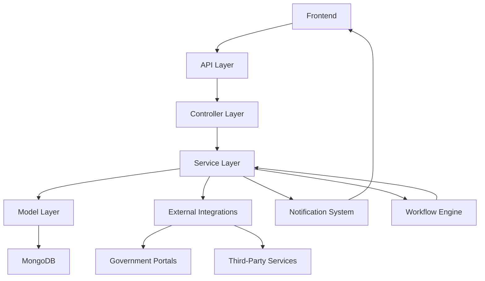

# System Architecture

The compliance module will follow the existing architectural patterns identified in the current system, extending them with compliance-specific components.

## Architecture Diagram

## Key Components

### 1. Model Layer
- Core compliance models (ComplianceType, ComplianceRequirement, CustomerCompliance, etc.)
- Extensions to existing models (ServiceType, ApplicationStatus, Task, etc.)
- Data validation rules for compliance-specific fields

### 2. Service Layer
- Compliance business logic services
- Workflow orchestration services
- Document processing services
- Integration services for government portals
- Compliance calendar and deadline management services

### 3. Controller Layer
- RESTful API endpoints for compliance operations
- Request validation for compliance operations
- Response formatting for compliance data
- Authentication and authorization checks

### 4. External Integrations
- Government portal connectors (MCA21, GST Portal, Income Tax Portal)
- Digital signature service integration
- Document verification services
- Third-party compliance checking tools

### 5. Notification System
- Compliance-specific notification templates
- Deadline reminder notifications
- Document request notifications
- Status update notifications
- Escalation alerts for compliance issues

### 6. Workflow Engine
- Compliance workflow definitions
- Stage transitions and conditions
- Approval workflows
- Automated and manual task generation
- Timeline management

## Integration with Existing System

The compliance module will integrate with the existing RegisterKaro system in several key areas:

1. **User Management**: Leveraging existing user authentication and authorization
2. **Entity Management**: Using existing entity data as the foundation for compliance relationships
3. **Document Management**: Extending the document system for compliance-specific documents
4. **Notification System**: Adding compliance notification types to the existing system
5. **Task Management**: Enhancing the task system to handle compliance-specific tasks
6. **Service Catalog**: Adding compliance services to the existing service catalog

## Technical Considerations

### Scalability
- Designed to handle large volumes of compliance records
- Efficient indexing for compliance queries
- Optimized for multi-entity management
- Horizontal scaling capability for document processing

### Security
- End-to-end encryption for sensitive compliance documents
- Enhanced audit logging for compliance operations
- Strong authentication for government portal integrations
- Role-based access controls for compliance data

### Performance
- Efficient handling of recurring compliance calculations
- Optimized document storage and retrieval
- Caching for compliance calendar and dashboard views
- Batch processing for compliance notifications

### Maintainability
- Modular design for easy extension
- Comprehensive test coverage
- Clear separation of concerns
- Detailed logging and monitoring