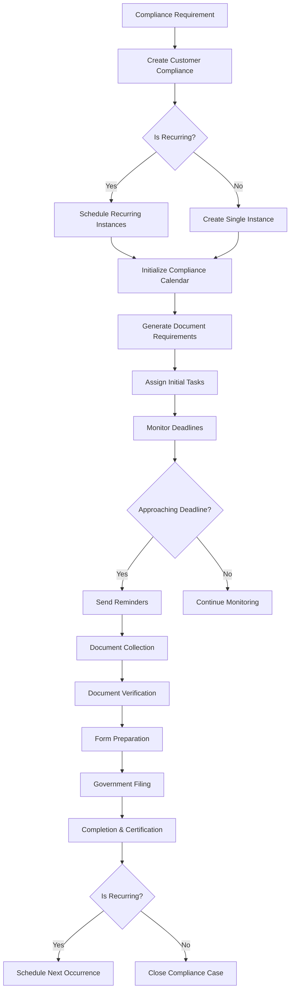
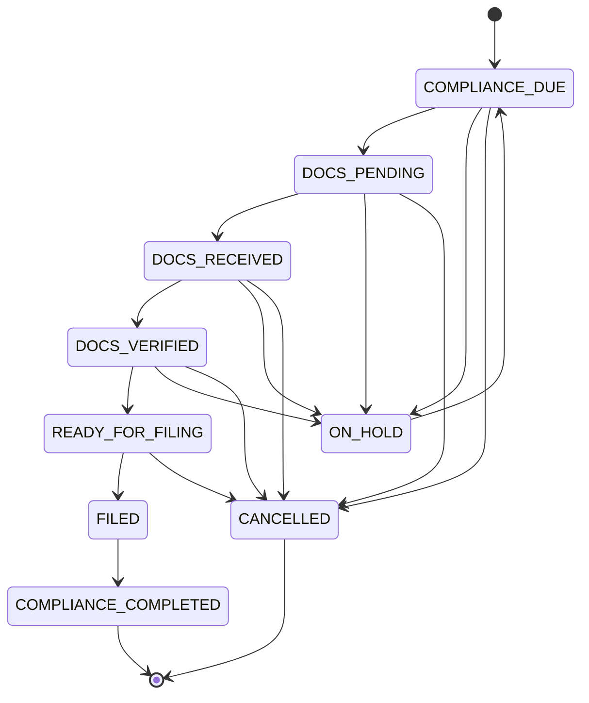

# Workflow Engine Design

The compliance module will extend the existing workflow engine to support compliance-specific workflows. This document details the design of the compliance workflow engine.

## Workflow Components

## Standard Compliance Workflow Stages

For each compliance type (e.g., Annual ROC Filing, GST Returns), standardized stages have been defined:

### 1. Initiation Stage

- **Purpose**: Set up the compliance requirement and establish timeline
- **Activities**:
  - Compliance requirement identification
  - Document requirement listing
  - Timeline establishment
  - Assignment to compliance officer
- **Entry Conditions**: Compliance service activated for entity
- **Exit Conditions**: All setup parameters configured and initial tasks assigned
- **Status Transition**: `PENDING` → `COMPLIANCE_DUE`

### 2. Document Collection Stage

- **Purpose**: Gather all required documents from the client
- **Activities**:
  - Document request notifications
  - Document upload functionality
  - Document tracking and reminders
  - Client communication
- **Entry Conditions**: Compliance initialized, document requirements defined
- **Exit Conditions**: All required documents uploaded
- **Status Transition**: `COMPLIANCE_DUE` → `DOCS_PENDING` → (when complete) → `DOCS_RECEIVED`

### 3. Verification Stage

- **Purpose**: Verify the correctness and completeness of submitted documents
- **Activities**:
  - Document verification
  - Data extraction and validation
  - Discrepancy resolution
  - Additional information requests
- **Entry Conditions**: All required documents submitted
- **Exit Conditions**: All documents verified and approved
- **Status Transition**: `DOCS_RECEIVED` → (when complete) → `DOCS_VERIFIED`

### 4. Preparation Stage

- **Purpose**: Prepare compliance forms and filings
- **Activities**:
  - Form filling
  - Calculation validation
  - Draft approval
  - Final review
- **Entry Conditions**: All documents verified
- **Exit Conditions**: Forms prepared and ready for filing
- **Status Transition**: `DOCS_VERIFIED` → (when complete) → `READY_FOR_FILING`

### 5. Filing Stage

- **Purpose**: Submit filings to government portals
- **Activities**:
  - Government portal integration
  - Filing submission
  - Payment processing
  - Acknowledgment receipt
- **Entry Conditions**: Forms prepared and approved
- **Exit Conditions**: Filing submitted and acknowledgment received
- **Status Transition**: `READY_FOR_FILING` → (when complete) → `FILED`

### 6. Completion Stage

- **Purpose**: Finalize the compliance process and provide proof of completion
- **Activities**:
  - Final status update
  - Document archival
  - Certificate/confirmation storage
  - Client notification
- **Entry Conditions**: Filing acknowledgment received
- **Exit Conditions**: All documentation completed and archived
- **Status Transition**: `FILED` → (when complete) → `COMPLIANCE_COMPLETED`

## Status Transition Rules

Status transitions are governed by defined rules that determine:
- Valid status transitions
- Required approvals for each transition
- Automated actions triggered by transitions
- Notifications to be sent

## Task Generation Rules

Compliance workflows generate tasks automatically based on defined rules:

### 1. Document Collection Tasks

- Generated for each required document
- Assigned based on document type and entity context
- Due dates calculated relative to compliance deadline
- Priority set based on timeline criticality

### 2. Verification Tasks

- Generated upon document submission
- Assigned to compliance officers based on document type expertise
- Due dates set to ensure timely processing
- May create additional tasks for discrepancy resolution

### 3. Form Preparation Tasks

- Generated upon document verification completion
- Assigned to designated form preparers
- Include references to verified documents
- Specific to form types for each compliance

### 4. Filing Tasks

- Generated when forms are ready for submission
- Assigned to officers with portal access and digital signature authority
- Include payment processing steps if applicable
- Track filing status and acknowledgments

## Deadline Management

The workflow engine handles deadline management through:

1. **Due Date Calculation**:
   - Based on statutory deadlines
   - Adjusts for holidays and weekends
   - Considers filing windows and fee structures

2. **Reminder Schedule**:
   - Configurable reminder points (e.g., 30, 15, 7, 3, 1 days before deadline)
   - Escalating urgency based on proximity to deadline
   - Multi-channel notifications (email, SMS, in-app)

3. **Overdue Management**:
   - Automatic status updates for missed deadlines
   - Escalation to managers
   - Penalty calculation and communication

## Recurring Compliance Handling

For recurring compliances (e.g., monthly GST returns, annual filings):

1. **Recurrence Pattern Definition**:
   - Frequency (monthly, quarterly, annual)
   - Anchor dates (fixed date, relative to entity incorporation date)
   - Custom patterns for special cases

2. **Instance Generation**:
   - Automatic creation of next compliance instance
   - Inheritance of configuration from previous instance
   - Adjustment of dates for new period

3. **Period Tracking**:
   - Tracking of compliance by financial year/period
   - Historical record maintenance
   - Period-specific document management

## Integration with Existing Workflow System

The compliance workflow engine extends the existing workflow system:

1. **Service Type Integration**:
   - Compliance services are specialized service types
   - Share common service lifecycle management
   - Use enhanced status tracking

2. **Stage Definition Reuse**:
   - Leverages existing stage definition framework
   - Adds compliance-specific stage types
   - Enhances with deadline management

3. **Task System Enhancement**:
   - Extends task assignment capabilities
   - Adds compliance-specific task types
   - Integrates with document verification workflows

## Workflow Customization

The workflow engine supports customization for different compliance types:

1. **Template-Based Configuration**:
   - Predefined workflow templates for common compliance types
   - Customizable stages and tasks
   - Entity-specific overrides

2. **Dynamic Task Generation**:
   - Rules-based task generation
   - Conditional task creation based on entity attributes
   - Variable document requirements

3. **Approval Workflows**:
   - Configurable approval chains
   - Multi-level verification requirements
   - Delegation rules for absences

## Performance Considerations

The workflow engine is designed with these performance considerations:

1. **Batch Processing**:
   - Batch generation of recurring compliances
   - Optimized for high volume periods (e.g., financial year end)
   - Background processing for non-interactive operations

2. **Indexing Strategy**:
   - Efficient indexing for deadline-based queries
   - Entity-based partitioning for large clients
   - Status-based access patterns

3. **Caching**:
   - Template caching for frequent workflow patterns
   - Status transition rule caching
   - Deadline calculation caching

## Workflow Monitoring and Metrics

The workflow engine provides monitoring capabilities:

1. **Progress Tracking**:
   - Real-time workflow progression visibility
   - Bottleneck identification
   - SLA compliance monitoring

2. **Workload Metrics**:
   - Task distribution across compliance officers
   - Processing time by stage and task type
   - Deadline adherence metrics

3. **Exception Handling**:
   - Detection of stalled workflows
   - Identification of recurring issues
   - Escalation paths for exceptions