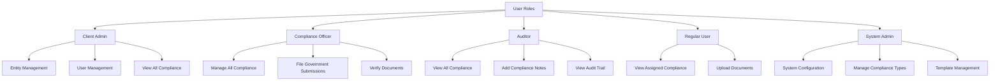

# Role-Based Access Control (RBAC) Security

The compliance module requires a robust role-based access control (RBAC) system to ensure that sensitive compliance data is accessible only to authorized users. This document outlines the RBAC design for the compliance module.

## User Roles and Permissions Matrix



## Role Definitions

### 1. Client Admin

**Description**: Entity owners or designated administrators who manage their company's compliance.

**Responsibilities**:
- Oversee compliance for their entities
- Manage user access within their organization
- View compliance status and reports
- Assign responsibilities to team members

**Access Level**: Full access to their entity's compliance data but cannot modify system-defined compliance types or templates.

### 2. Compliance Officer

**Description**: RegisterKaro staff responsible for managing compliance services.

**Responsibilities**:
- Process compliance documents
- Update compliance status
- File submissions with government portals
- Communicate with clients about compliance requirements

**Access Level**: Full access to assigned entities' compliance data with the ability to modify status, verify documents, and create/update compliance records.

### 3. Auditor

**Description**: Internal or external auditors who review compliance processes.

**Responsibilities**:
- Review compliance status
- Audit document trails
- Verify compliance with regulations
- Generate compliance reports

**Access Level**: Read-only access to compliance data with the ability to add notes and generate reports.

### 4. Regular User

**Description**: Standard users assigned specific compliance tasks.

**Responsibilities**:
- Upload required documents
- View assigned compliance tasks
- Track compliance status
- Receive notifications

**Access Level**: Limited access to view assigned compliance records and upload documents.

### 5. System Admin

**Description**: RegisterKaro administrators with system-wide configuration rights.

**Responsibilities**:
- Configure system settings
- Manage compliance types and templates
- Handle user role assignments
- Oversee system-wide operations

**Access Level**: Full access to all system components, including configuration and setup.

## Permission Sets

The following granular permissions will be implemented for compliance-related operations:

### Compliance Type Management
- **compliance.type.view**: View compliance types
- **compliance.type.create**: Create new compliance types
- **compliance.type.update**: Update compliance types
- **compliance.type.delete**: Delete compliance types

### Compliance Requirement Management
- **compliance.requirement.view**: View compliance requirements
- **compliance.requirement.create**: Create new compliance requirements
- **compliance.requirement.update**: Update compliance requirements
- **compliance.requirement.delete**: Delete compliance requirements

### Customer Compliance Management
- **compliance.customer.view**: View customer compliance records
- **compliance.customer.create**: Create new customer compliance records
- **compliance.customer.update**: Update customer compliance records
- **compliance.customer.delete**: Delete customer compliance records
- **compliance.customer.status.update**: Update compliance status

### Compliance Document Management
- **compliance.document.view**: View compliance documents
- **compliance.document.upload**: Upload compliance documents
- **compliance.document.verify**: Verify compliance documents
- **compliance.document.delete**: Delete compliance documents

### Compliance Filing Management
- **compliance.filing.create**: Create compliance filings
- **compliance.filing.submit**: Submit filings to government portals
- **compliance.filing.view**: View filing status and history

### Compliance Calendar Management
- **compliance.calendar.view**: View compliance calendar
- **compliance.calendar.manage**: Manage compliance deadlines

## Role-Permission Mapping

The mapping of roles to permissions ensures appropriate access levels:

### Client Admin
- compliance.customer.view
- compliance.document.view
- compliance.document.upload
- compliance.customer.status.update (for their entities only)
- compliance.calendar.view
- compliance.filing.view

### Compliance Officer
- compliance.customer.view
- compliance.customer.create
- compliance.customer.update
- compliance.customer.status.update
- compliance.document.view
- compliance.document.upload
- compliance.document.verify
- compliance.filing.create
- compliance.filing.submit
- compliance.filing.view
- compliance.calendar.view
- compliance.calendar.manage

### Auditor
- compliance.customer.view
- compliance.document.view
- compliance.filing.view
- compliance.calendar.view

### Regular User
- compliance.customer.view (assigned only)
- compliance.document.view (assigned only)
- compliance.document.upload
- compliance.calendar.view (personal calendar only)

### System Admin
- All permissions

## Access Control Implementation

### 1. Middleware-Based Access Control

The system will implement middleware-based access control to enforce permissions:

```javascript
/**
 * Middleware to check if user has required permission
 * @param {String} permission - Required permission
 * @returns {Function} - Express middleware
 */
const hasPermission = (permission) => {
  return async (req, res, next) => {
    try {
      const user = req.user;
      
      if (!user) {
        return res.status(401).json({ 
          success: false,
          error: {
            code: 'UNAUTHORIZED',
            message: 'Authentication required'
          }
        });
      }
      
      // System admin has all permissions
      if (user.role === 'SYSTEM_ADMIN') {
        return next();
      }
      
      // Get user's permissions from role
      const userPermissions = await getUserPermissions(user.id);
      
      if (userPermissions.includes(permission)) {
        return next();
      }
      
      // Check entity-specific permissions
      if (permission.startsWith('compliance.customer') && req.params.entityId) {
        const hasEntityAccess = await checkEntityAccess(user.id, req.params.entityId);
        
        if (hasEntityAccess) {
          return next();
        }
      }
      
      return res.status(403).json({
        success: false,
        error: {
          code: 'FORBIDDEN',
          message: 'Insufficient permissions'
        }
      });
    } catch (error) {
      next(error);
    }
  };
};
```

### 2. Entity-Based Access Control

For client admins and regular users, access is further restricted by entity:

```javascript
/**
 * Check if user has access to an entity
 * @param {String} userId - User ID
 * @param {String} entityId - Entity ID
 * @returns {Promise<Boolean>} - Whether user has access
 */
const checkEntityAccess = async (userId, entityId) => {
  // Check direct entity assignment
  const userEntityContext = await UserEntityContext.findOne({
    userId,
    entityId
  });
  
  if (userEntityContext) {
    return true;
  }
  
  // Check if user is an admin for this entity
  const user = await User.findById(userId);
  
  if (user.role === 'CLIENT_ADMIN') {
    const entity = await Entity.findById(entityId);
    
    if (entity && entity.adminUserId === userId) {
      return true;
    }
  }
  
  return false;
};
```

### 3. Document-Level Access Control

Document access is controlled based on document type and relation to compliance:

```javascript
/**
 * Check if user has access to a compliance document
 * @param {String} userId - User ID
 * @param {String} documentId - Document ID
 * @returns {Promise<Boolean>} - Whether user has access
 */
const checkDocumentAccess = async (userId, documentId) => {
  const document = await ComplianceDocument.findById(documentId);
  
  if (!document) {
    return false;
  }
  
  // Check if user has access to the compliance record
  const compliance = await CustomerCompliance.findById(document.complianceId);
  
  if (!compliance) {
    return false;
  }
  
  return checkEntityAccess(userId, compliance.entityId);
};
```

## Data Security Measures

In addition to access controls, the following security measures will be implemented:

### 1. Data Encryption

- All sensitive compliance data will be encrypted at rest
- Document storage will use encryption for sensitive files
- Transmission of compliance data will be encrypted using TLS

### 2. Audit Logging

- All compliance-related actions will be logged with user, timestamp, and IP
- Access to sensitive compliance documents will be recorded
- Status changes will maintain a detailed history with user attribution

```javascript
/**
 * Log compliance action for audit
 * @param {Object} data - Audit data
 * @returns {Promise<Object>} - Created audit log
 */
const logComplianceAction = async (data) => {
  const { userId, action, entityId, complianceId, documentId, details, ip } = data;
  
  return await UserActivity.create({
    userId,
    activityType: `COMPLIANCE_${action}`,
    entityId,
    referenceId: complianceId || documentId,
    referenceType: complianceId ? 'COMPLIANCE' : 'DOCUMENT',
    description: details.description,
    details,
    ipAddress: ip,
    status: 'success'
  });
};
```

### 3. Session Management

- Short session timeouts for compliance officer activities
- Enhanced authentication for critical compliance operations
- IP restriction options for compliance management

### 4. Data Retention

- Compliance records will be retained according to regulatory requirements
- Document retention policies will be configurable by compliance type
- Automatic archiving of completed compliance records after retention period

## Compliance Officer Assignment

To further enhance security, compliance officers will be assigned to specific entities:

```javascript
/**
 * Assign compliance officer to entity
 * @param {String} entityId - Entity ID
 * @param {String} userId - Compliance officer user ID
 * @returns {Promise<Object>} - Assignment record
 */
const assignComplianceOfficer = async (entityId, userId) => {
  // Validate user is a compliance officer
  const user = await User.findById(userId);
  
  if (!user || user.role !== 'COMPLIANCE_OFFICER') {
    throw new Error('User is not a compliance officer');
  }
  
  // Create or update assignment
  return await EntityComplianceAssignment.findOneAndUpdate(
    { entityId },
    { 
      entityId,
      userId,
      assignedAt: new Date(),
      status: 'ACTIVE'
    },
    { upsert: true, new: true }
  );
};
```

## Security Testing

Security testing for the compliance module will include:

1. **Permission Testing**: Verification that each role can only access permitted functions
2. **Entity Isolation Testing**: Confirmation that users can only access assigned entities
3. **Penetration Testing**: Security assessment of compliance APIs and data access
4. **Audit Log Verification**: Validation of comprehensive action logging

## Continuous Security Monitoring

The system will implement continuous security monitoring:

1. **Anomaly Detection**: Monitoring for unusual compliance data access patterns
2. **Access Reviews**: Periodic review of compliance officer assignments
3. **Permission Audits**: Regular verification of role-permission mappings
4. **Security Patching**: Timely updates to address security vulnerabilities