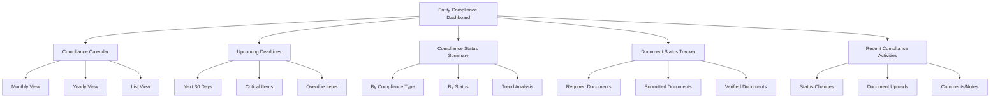
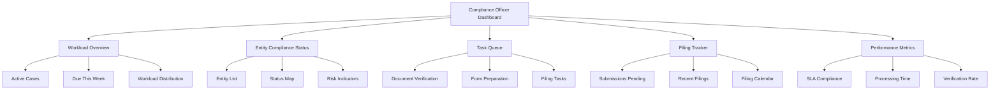
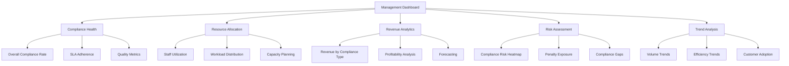

# Dashboard and Reporting Features

The compliance module will include comprehensive dashboard and reporting capabilities to provide visibility into compliance status, deadlines, and metrics. This document outlines the dashboard and reporting features of the compliance module.

## Dashboard Types

### 1. Entity Compliance Dashboard

This dashboard provides entity owners and administrators with a comprehensive view of their compliance status.



#### Key Components:

1. **Compliance Calendar**
   - Interactive calendar showing all compliance deadlines
   - Color-coded by status and priority
   - Filter by compliance type, status, and date range
   - Toggle between monthly, quarterly, and yearly views

2. **Upcoming Deadlines**
   - List of approaching compliance deadlines
   - Sorted by due date with countdown
   - Highlighted based on priority and status
   - Quick actions for document upload and status update

3. **Compliance Status Summary**
   - Graphical summary of compliance statuses
   - Pie chart showing distribution by status
   - Bar chart showing distribution by compliance type
   - Trend line showing status changes over time

4. **Document Status Tracker**
   - List of required documents with submission status
   - Progress bars for document completion
   - Quick upload and verification actions
   - Filtering by document type and status

5. **Recent Compliance Activities**
   - Timeline of recent compliance-related activities
   - Status changes, document uploads, comments
   - Filterable by activity type and date range
   - Direct links to relevant compliance records

### 2. Compliance Officer Dashboard

This dashboard provides compliance officers with a multi-entity view of their assigned compliance cases.



#### Key Components:

1. **Workload Overview**
   - Summary of active cases assigned
   - Distribution by entity, compliance type, and status
   - Highlight of items due in the next 7 days
   - Workload balancing recommendations

2. **Entity Compliance Status**
   - List of assigned entities with compliance status
   - Visual indicators for high-risk or overdue items
   - Filtering by entity type, compliance type, and status
   - Direct links to entity compliance records

3. **Task Queue**
   - Prioritized list of pending tasks
   - Grouped by task type and deadline
   - Quick actions for task completion
   - Filtering by task type, priority, and due date

4. **Filing Tracker**
   - Status of government portal submissions
   - Pending acknowledgments
   - Recent successful filings
   - Filing calendar for upcoming submissions

5. **Performance Metrics**
   - SLA compliance percentage
   - Average processing time by task type
   - Document verification rate
   - Customer satisfaction metrics

### 3. Management Dashboard

This dashboard provides management with high-level compliance metrics and analytics.



#### Key Components:

1. **Compliance Health**
   - Overall compliance rate across entities
   - SLA adherence metrics
   - Quality assurance metrics
   - Compliance completion trends

2. **Resource Allocation**
   - Staff utilization rates
   - Workload distribution across compliance officers
   - Capacity vs. demand analysis
   - Resource optimization recommendations

3. **Revenue Analytics**
   - Revenue generated by compliance type
   - Profitability analysis
   - Revenue forecasting
   - Upsell/cross-sell opportunities

4. **Risk Assessment**
   - Compliance risk heatmap
   - Potential penalty exposure
   - Identified compliance gaps
   - Regulatory change impact analysis

5. **Trend Analysis**
   - Volume trends by compliance type
   - Efficiency trends over time
   - Customer adoption of compliance services
   - Seasonal patterns and peak periods

## Report Types

### 1. Compliance Status Reports

Reports that provide detailed information about compliance status:

#### Entity Compliance Summary Report

```json
{
  "reportName": "Entity Compliance Summary",
  "entityId": "60d21b4667d0d8992e610c89",
  "entityName": "XYZ Pvt Ltd",
  "reportPeriod": "FY 2023-24",
  "generatedAt": "2023-05-01T12:00:00Z",
  "complianceStatusSummary": {
    "total": 24,
    "completed": 18,
    "inProgress": 4,
    "pending": 2,
    "overdue": 0,
    "complianceRate": 75.0
  },
  "byComplianceType": [
    {
      "complianceType": "Annual ROC Filing",
      "total": 1,
      "completed": 1,
      "inProgress": 0,
      "pending": 0,
      "overdue": 0,
      "complianceRate": 100.0
    },
    {
      "complianceType": "GST Returns",
      "total": 12,
      "completed": 10,
      "inProgress": 2,
      "pending": 0,
      "overdue": 0,
      "complianceRate": 83.3
    },
    // Other compliance types...
  ],
  "upcomingDeadlines": [
    {
      "complianceId": "60d21b4667d0d8992e610c88",
      "complianceType": "GST Return - May 2023",
      "dueDate": "2023-06-20T00:00:00Z",
      "status": "PENDING",
      "daysRemaining": 20
    }
    // Other upcoming deadlines...
  ]
}
```

#### Compliance Officer Workload Report

```json
{
  "reportName": "Compliance Officer Workload",
  "officerId": "60d21b4667d0d8992e610c91",
  "officerName": "John Doe",
  "reportPeriod": "May 2023",
  "generatedAt": "2023-05-01T12:00:00Z",
  "workloadSummary": {
    "totalEntities": 15,
    "totalComplianceItems": 45,
    "activeItems": 28,
    "itemsDueThisMonth": 12,
    "overdueItems": 2
  },
  "taskSummary": {
    "totalTasks": 68,
    "completedTasks": 42,
    "pendingTasks": 26,
    "tasksByType": {
      "documentVerification": 18,
      "formPreparation": 12,
      "filing": 8,
      "other": 30
    }
  },
  "entityWorkload": [
    {
      "entityId": "60d21b4667d0d8992e610c89",
      "entityName": "XYZ Pvt Ltd",
      "activeComplianceItems": 5,
      "pendingTasks": 8,
      "upcomingDeadlines": 2
    }
    // Other entities...
  ],
  "slaPerformance": {
    "overall": 92.5,
    "byTaskType": {
      "documentVerification": 94.2,
      "formPreparation": 91.8,
      "filing": 90.0,
      "other": 93.0
    }
  }
}
```

### 2. Deadline Tracking Reports

Reports that focus on compliance deadlines:

#### Upcoming Compliance Deadlines Report

```json
{
  "reportName": "Upcoming Compliance Deadlines",
  "reportPeriod": "Next 30 days",
  "generatedAt": "2023-05-01T12:00:00Z",
  "deadlinesSummary": {
    "total": 28,
    "byPriority": {
      "critical": 5,
      "high": 10,
      "medium": 8,
      "low": 5
    },
    "byType": {
      "Annual ROC Filing": 2,
      "GST Returns": 15,
      "Income Tax": 5,
      "Other": 6
    }
  },
  "deadlines": [
    {
      "complianceId": "60d21b4667d0d8992e610c88",
      "entityId": "60d21b4667d0d8992e610c89",
      "entityName": "XYZ Pvt Ltd",
      "complianceType": "GST Return - May 2023",
      "dueDate": "2023-06-20T00:00:00Z",
      "status": "PENDING",
      "priority": "HIGH",
      "daysRemaining": 20,
      "assignedTo": "John Doe"
    }
    // Other deadlines...
  ],
  "overdueItems": [
    {
      "complianceId": "60d21b4667d0d8992e610c96",
      "entityId": "60d21b4667d0d8992e610c97",
      "entityName": "ABC Pvt Ltd",
      "complianceType": "Income Tax Return",
      "dueDate": "2023-04-15T00:00:00Z",
      "status": "OVERDUE",
      "priority": "CRITICAL",
      "daysOverdue": 16,
      "assignedTo": "Jane Smith"
    }
    // Other overdue items...
  ]
}
```

#### Annual Compliance Calendar Report

```json
{
  "reportName": "Annual Compliance Calendar",
  "entityId": "60d21b4667d0d8992e610c89",
  "entityName": "XYZ Pvt Ltd",
  "year": 2023,
  "generatedAt": "2023-01-01T12:00:00Z",
  "calendarSummary": {
    "totalComplianceItems": 36,
    "byMonth": {
      "January": 3,
      "February": 2,
      "March": 5,
      "April": 3,
      "May": 3,
      "June": 3,
      "July": 3,
      "August": 2,
      "September": 3,
      "October": 3,
      "November": 3,
      "December": 3
    },
    "byType": {
      "Annual ROC Filing": 1,
      "GST Returns": 12,
      "Income Tax": 4,
      "TDS Returns": 4,
      "Other": 15
    }
  },
  "monthlyCalendar": [
    {
      "month": "January",
      "compliances": [
        {
          "complianceId": "60d21b4667d0d8992e610c99",
          "complianceType": "GST Return - December 2022",
          "dueDate": "2023-01-20T00:00:00Z",
          "description": "Monthly GST return for December 2022",
          "priority": "HIGH"
        }
        // Other January compliances...
      ]
    }
    // Other months...
  ]
}
```

### 3. Document Management Reports

Reports related to compliance documentation:

#### Document Status Report

```json
{
  "reportName": "Document Status Report",
  "entityId": "60d21b4667d0d8992e610c89",
  "entityName": "XYZ Pvt Ltd",
  "reportPeriod": "Current",
  "generatedAt": "2023-05-01T12:00:00Z",
  "documentSummary": {
    "total": 45,
    "byStatus": {
      "pending": 8,
      "uploaded": 12,
      "verified": 22,
      "rejected": 3
    },
    "byType": {
      "financial": 15,
      "legal": 10,
      "tax": 12,
      "other": 8
    }
  },
  "pendingDocuments": [
    {
      "documentId": "60d21b4667d0d8992e610d00",
      "documentType": "Balance Sheet",
      "complianceId": "60d21b4667d0d8992e610c88",
      "complianceType": "Annual ROC Filing",
      "requiredBy": "2023-06-01T00:00:00Z",
      "status": "PENDING"
    }
    // Other pending documents...
  ],
  "recentUploads": [
    {
      "documentId": "60d21b4667d0d8992e610d01",
      "documentType": "GST Invoice Register",
      "complianceId": "60d21b4667d0d8992e610c88",
      "complianceType": "GST Return - April 2023",
      "uploadedAt": "2023-05-10T10:30:00Z",
      "uploadedBy": "Client User",
      "status": "UPLOADED"
    }
    // Other recent uploads...
  ],
  "verificationPending": [
    {
      "documentId": "60d21b4667d0d8992e610d01",
      "documentType": "GST Invoice Register",
      "complianceId": "60d21b4667d0d8992e610c88",
      "complianceType": "GST Return - April 2023",
      "uploadedAt": "2023-05-10T10:30:00Z",
      "assignedTo": "John Doe",
      "status": "UPLOADED"
    }
    // Other documents pending verification...
  ]
}
```

#### Document Verification Report

```json
{
  "reportName": "Document Verification Report",
  "reportPeriod": "April 2023",
  "generatedAt": "2023-05-01T12:00:00Z",
  "verificationSummary": {
    "totalVerified": 120,
    "approvalRate": 92.5,
    "averageTurnaroundTime": 18.5, // hours
    "byVerifier": [
      {
        "verifierId": "60d21b4667d0d8992e610c91",
        "verifierName": "John Doe",
        "verified": 45,
        "approved": 42,
        "rejected": 3,
        "approvalRate": 93.3,
        "averageTurnaroundTime": 16.2
      }
      // Other verifiers...
    ]
  },
  "documentTypePerformance": [
    {
      "documentType": "Financial Statements",
      "verified": 25,
      "approvalRate": 88.0,
      "averageTurnaroundTime": 24.5,
      "commonIssues": [
        "Missing director signatures",
        "Incomplete notes to accounts",
        "Format inconsistencies"
      ]
    }
    // Other document types...
  ],
  "rejectionAnalysis": {
    "topReasons": [
      {
        "reason": "Incomplete document",
        "count": 5,
        "percentage": 35.7
      },
      {
        "reason": "Incorrect format",
        "count": 4,
        "percentage": 28.6
      },
      {
        "reason": "Data inconsistency",
        "count": 3,
        "percentage": 21.4
      },
      {
        "reason": "Other",
        "count": 2,
        "percentage": 14.3
      }
    ]
  }
}
```

### 4. Performance and Analytics Reports

Reports that provide insights into compliance operations:

#### Compliance SLA Performance Report

```json
{
  "reportName": "Compliance SLA Performance",
  "reportPeriod": "Q1 2023",
  "generatedAt": "2023-04-01T12:00:00Z",
  "overallPerformance": {
    "slaComplianceRate": 94.2,
    "averageProcessingTime": {
      "documentVerification": 16.5, // hours
      "formPreparation": 28.3, // hours
      "filing": 12.1 // hours
    },
    "onTimeCompletionRate": 92.8
  },
  "trendAnalysis": {
    "slaComplianceRate": [
      { "period": "Jan 2023", "value": 93.5 },
      { "period": "Feb 2023", "value": 94.0 },
      { "period": "Mar 2023", "value": 95.0 }
    ],
    "averageProcessingTime": [
      { "period": "Jan 2023", "value": 20.5 },
      { "period": "Feb 2023", "value": 19.2 },
      { "period": "Mar 2023", "value": 18.7 }
    ]
  },
  "byComplianceType": [
    {
      "complianceType": "GST Returns",
      "slaComplianceRate": 96.5,
      "averageProcessingTime": 15.2,
      "onTimeCompletionRate": 95.8
    }
    // Other compliance types...
  ],
  "byStaff": [
    {
      "staffId": "60d21b4667d0d8992e610c91",
      "staffName": "John Doe",
      "slaComplianceRate": 97.2,
      "averageProcessingTime": 14.5,
      "onTimeCompletionRate": 96.3,
      "workloadVolume": 45
    }
    // Other staff members...
  ],
  "improvementOpportunities": [
    {
      "area": "Income Tax Return Processing",
      "currentSla": 88.5,
      "targetSla": 95.0,
      "recommendedActions": [
        "Implement pre-verification document checklist",
        "Enhance data extraction automation",
        "Adjust resource allocation during peak periods"
      ]
    }
    // Other improvement areas...
  ]
}
```

#### Compliance Analytics Report

```json
{
  "reportName": "Compliance Analytics",
  "reportPeriod": "FY 2022-23",
  "generatedAt": "2023-04-01T12:00:00Z",
  "volumeAnalysis": {
    "totalComplianceItems": 1245,
    "growthFromPreviousYear": 15.2,
    "byComplianceType": [
      { "type": "GST Returns", "count": 520, "percentage": 41.8 },
      { "type": "Income Tax", "count": 180, "percentage": 14.5 },
      { "type": "Annual ROC Filing", "count": 120, "percentage": 9.6 },
      { "type": "Other", "count": 425, "percentage": 34.1 }
    ],
    "seasonalTrends": [
      { "month": "April", "count": 145, "deviation": 39.8 },
      { "month": "May", "count": 95, "deviation": -8.7 },
      // Other months...
    ]
  },
  "efficiencyAnalysis": {
    "averageCompletionTime": 22.5, // days
    "improvementFromPreviousYear": 12.3, // percentage
    "bottlenecks": [
      {
        "stage": "Document Collection",
        "averageDuration": 8.5, // days
        "impact": "HIGH",
        "trendDirection": "IMPROVING"
      },
      // Other bottlenecks...
    ],
    "automationImpact": {
      "tasksAutomated": 320,
      "hoursAvoided": 960,
      "costSavings": 28800
    }
  },
  "customerAnalysis": {
    "satisfactionScore": 4.2, // out of 5
    "netPromoterScore": 48,
    "topCustomerConcerns": [
      { "concern": "Document request frequency", "mentionCount": 28 },
      { "concern": "Status update clarity", "mentionCount": 22 },
      // Other concerns...
    ],
    "retentionRate": 94.5
  },
  "revenueAnalysis": {
    "totalRevenue": 1850000,
    "growthFromPreviousYear": 18.5,
    "byComplianceType": [
      { "type": "GST Returns", "revenue": 520000, "percentage": 28.1 },
      { "type": "Income Tax", "revenue": 380000, "percentage": 20.5 },
      // Other types...
    ],
    "profitMargin": 42.5,
    "revenuePerEntity": 15420
  }
}
```

## Report Generation Engine

### 1. Report Builder

The compliance module will include a flexible report builder with the following capabilities:

- **Template-Based Generation**: Pre-defined report templates for common reports
- **Custom Report Builder**: UI for building custom reports with drag-and-drop fields
- **Parameter Selection**: Filters for entity, date range, compliance type, etc.
- **Scheduled Reports**: Capability to schedule automated report generation
- **Batch Processing**: Efficient generation of multiple reports

### 2. Export Formats

Reports can be exported in multiple formats:

- **PDF**: Formal reports with headers, footers, and pagination
- **Excel**: Tabular data for further analysis
- **CSV**: Raw data for import into other systems
- **JSON**: Structured data for API consumption
- **HTML**: Interactive web-based reports

### 3. Report Distribution

Reports can be distributed through multiple channels:

- **Email**: Automated email delivery of reports
- **Download**: Direct download from the dashboard
- **Shared Storage**: Storage in shared document repositories
- **API Access**: Programmatic access to report data

## Dashboard Implementation

### 1. Frontend Technology

The dashboard will be implemented using:

- **React Components**: Reusable dashboard widgets
- **Chart.js/D3.js**: Data visualization components
- **Material UI/Tailwind**: UI component framework
- **Redux/Context API**: State management
- **React Query**: Data fetching and caching

### 2. Backend Services

The dashboard will be powered by these backend services:

- **Aggregation Service**: Real-time data aggregation
- **Analytics Service**: Complex metric calculations
- **Reporting Service**: Report generation and distribution
- **Caching Layer**: Performance optimization for dashboard data

### 3. Real-Time Updates

The dashboard will support real-time updates through:

- **WebSocket Integration**: Push updates for critical metrics
- **Polling Strategy**: Regular data refresh for less critical metrics
- **Event-Driven Updates**: Updates triggered by specific system events

## Performance Considerations

### 1. Data Aggregation

- Pre-calculated aggregations for common metrics
- Materialized views for frequently accessed data
- Incremental computation for time-series data
- Scheduled background processing for complex calculations

### 2. Caching Strategy

- Multi-level caching (application, database, CDN)
- Time-based cache invalidation based on data volatility
- Entity-based cache partitioning
- Cache warming for predictable report requests

### 3. Scalability

- Horizontal scaling of reporting services
- Asynchronous report generation for large reports
- Queue-based processing for high-volume periods
- Resource isolation for critical dashboard components