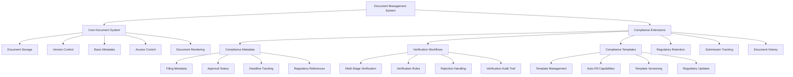
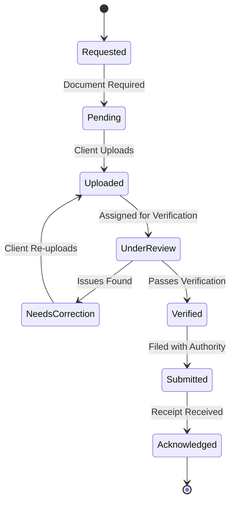
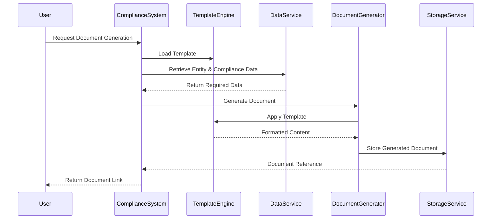

# Document Management Extensions

The compliance module will extend RegisterKaro's existing document management system with specialized features for handling compliance-related documents. This document outlines the extensions and enhancements required for effective compliance document management.

## Overview

Compliance document management requires specialized handling due to:
- Strict regulatory requirements for document retention
- Verification workflows specific to compliance documents
- Specialized templates for statutory filings
- Chain of custody requirements for legal documents
- Need for advanced document metadata related to compliance status

## Document Management System Extensions



### 1. Enhanced Document Metadata

The existing document model will be extended with compliance-specific metadata:

```json
{
  "documentId": "60d21b4667d0d8992e610d00",
  "documentType": "Balance Sheet",
  "entityId": "60d21b4667d0d8992e610c89",
  "version": 2,
  "fileName": "balance_sheet_fy_2022_23.pdf",
  "uploadedBy": "60d21b4667d0d8992e610c91",
  "uploadedAt": "2023-05-01T10:30:00Z",
  "fileSize": 1024000,
  "mimeType": "application/pdf",
  "status": "VERIFIED",
  
  // Compliance Extensions
  "complianceMetadata": {
    "complianceId": "60d21b4667d0d8992e610c88",
    "complianceType": "Annual ROC Filing",
    "financialYear": "2022-23",
    "filingDeadline": "2023-10-30T00:00:00Z",
    "regulatoryReference": "Companies Act 2013, Section 137",
    "verificationStatus": "VERIFIED",
    "verifiedBy": "60d21b4667d0d8992e610c92",
    "verifiedAt": "2023-05-02T14:20:00Z",
    "rejectionHistory": [],
    "submissionId": "MCA_20230503_12345",
    "submittedAt": "2023-05-03T09:15:00Z",
    "acknowledgmentReceived": true,
    "acknowledgmentId": "VCVC6741001_03052023",
    "retentionPeriod": "8 years",
    "retentionEndDate": "2031-03-31T00:00:00Z",
    "isDigitallySigned": true,
    "signatureDetails": {
      "signedBy": "60d21b4667d0d8992e610c93",
      "signedAt": "2023-05-02T11:30:00Z",
      "certificateDetails": "DSC issued by e-Mudhra, valid until 2025-04-30",
      "signatureVerification": "VALID"
    }
  }
}
```

#### Key Metadata Extensions:

1. **Compliance Context**
   - Association with specific compliance requirement
   - Financial year or period reference
   - Regulatory references and citations
   - Filing deadline tracking

2. **Verification Status**
   - Enhanced verification states (pending, under review, verified, rejected)
   - Verification audit trail
   - Rejection history with reasons and corrective actions
   - Verification officer assignment

3. **Filing Information**
   - Submission tracking with external systems
   - Acknowledgment management
   - Receipt references and confirmations
   - Government portal transaction IDs

4. **Retention Management**
   - Regulatory retention periods
   - Retention policies based on document type
   - Disposition scheduling
   - Legal hold capability

5. **Digital Signature Enhancements**
   - Extended signature metadata
   - Signature verification status
   - Certificate details and validation
   - Multi-signatory support

### 2. Document Verification Workflows



#### Verification Process Extensions:

1. **Multi-Level Verification**
   - First-level verification by compliance officers
   - Second-level review for critical documents
   - Final approval by authorized signatories
   - Escalation paths for exceptions

2. **Verification Checklists**
   - Document-type specific verification criteria
   - Structured validation checks
   - Automated validation for machine-readable documents
   - Compliance requirement mapping

3. **Rejection Handling**
   - Structured rejection reasons
   - Detailed feedback mechanism
   - Correction instructions
   - Version comparison on resubmission

4. **Verification SLAs**
   - Configurable verification timeframes
   - Priority-based verification queuing
   - SLA tracking and alerting
   - Workload distribution

### 3. Compliance Document Templates

The system will be extended with a specialized template management system for compliance documents:

```json
{
  "templateId": "60d21b4667d0d8992e610e00",
  "templateName": "Form DIR-3 KYC",
  "templateType": "MCA_FILING",
  "description": "Annual KYC for Directors",
  "version": "FY 2023-24",
  "effectiveFrom": "2023-04-01T00:00:00Z",
  "effectiveTo": "2024-03-31T00:00:00Z",
  "fileFormat": "PDF",
  "templateFile": "dir_3_kyc_template_2023_24.pdf",
  "isActive": true,
  "regulatoryReference": "Companies Act 2013, Rule 12A",
  "createdAt": "2023-03-15T00:00:00Z",
  "updatedAt": "2023-03-15T00:00:00Z",
  
  "mappingSchema": {
    "personalDetails": {
      "firstName": {
        "fieldId": "dir_first_name",
        "dataSource": "person.firstName",
        "required": true,
        "validation": "alphabetic"
      },
      "lastName": {
        "fieldId": "dir_last_name",
        "dataSource": "person.lastName",
        "required": true,
        "validation": "alphabetic"
      },
      "directorIdentificationNumber": {
        "fieldId": "din_number",
        "dataSource": "person.din",
        "required": true,
        "validation": "numeric",
        "validationPattern": "^[0-9]{8}$"
      },
      // Other personal details...
    },
    "contactDetails": {
      "email": {
        "fieldId": "dir_email",
        "dataSource": "person.contactDetails.email",
        "required": true,
        "validation": "email"
      },
      // Other contact details...
    },
    "addressDetails": {
      // Address fields...
    },
    "declarationDetails": {
      // Declaration fields...
    }
  },
  
  "autoFillRules": [
    {
      "condition": "person.residentialStatus === 'NON_RESIDENT'",
      "actions": [
        {
          "field": "overseas_address",
          "visible": true,
          "required": true
        },
        {
          "field": "passport_details",
          "visible": true,
          "required": true
        }
      ]
    }
    // Other conditional rules...
  ],
  
  "verificationChecklist": [
    {
      "checkId": "signature_verification",
      "description": "Verify digital signature is valid",
      "required": true
    },
    {
      "checkId": "address_proof_verification",
      "description": "Verify address proof is attached and valid",
      "required": true
    }
    // Other verification checks...
  ]
}
```

#### Template System Extensions:

1. **Regulatory Template Management**
   - Template version control aligned with regulatory updates
   - Template effective dates management
   - Automatic template updates based on regulatory changes
   - Template testing and validation workflows

2. **Advanced Data Mapping**
   - Field-level mapping to centralized data model
   - Conditional field visibility and requirements
   - Data transformation rules
   - Validation schemas

3. **Auto-Fill Capabilities**
   - Intelligent data population from entity and person records
   - Document pre-filling based on previous submissions
   - Conditional logic for form fields
   - Data consistency checks

4. **Template Analytics**
   - Usage tracking by template
   - Error rate monitoring
   - Completion time analytics
   - Field-level validation failure analysis

### 4. Document Storage Enhancements

The existing storage system will be extended with the following capabilities:

1. **Regulatory Compliance**
   - Immutable storage for compliance documents
   - Cryptographic hashing for document integrity
   - Enhanced audit trails for document access
   - Geographic storage compliance (data residency)

2. **Advanced Search and Retrieval**
   - Compliance-specific search filters
   - Full-text search within compliance documents
   - Metadata-based faceted search
   - Regulatory cross-reference search

3. **Archival and Retention**
   - Policy-driven retention periods
   - Automatic archival workflows
   - Compliance-based disposition rules
   - Legal hold mechanism

4. **Performance Optimization**
   - Tiered storage for compliance documents
   - Access pattern-based optimization
   - Batch processing for regulatory submissions
   - Caching strategies for frequently accessed documents

### 5. Document Generation System

The compliance module will include an enhanced document generation system:



#### Generation System Features:

1. **Multi-Format Generation**
   - PDF generation with precise formatting
   - Form-fillable PDF support
   - XML/JSON generation for direct API submissions
   - HTML generation for web-based submissions

2. **Data Integration**
   - Dynamic data population from multiple sources
   - Real-time data validation during generation
   - Historical data access for comparative reporting
   - Calculated field support

3. **Batch Processing**
   - Bulk document generation for multiple entities
   - Scheduled generation for periodic compliance
   - Queue-based processing for high-volume periods
   - Progress tracking for long-running generation

4. **Digital Signatures**
   - Embedded signature workflows
   - Batch signing capabilities
   - Signature verification and validation
   - Signature positioning and visualization

### 6. Document Comparison and Analysis

The system will include specialized document comparison capabilities:

1. **Version Comparison**
   - Side-by-side comparison of document versions
   - Change highlighting and annotation
   - Metadata change tracking
   - Historical version navigation

2. **Compliance Analysis**
   - Automated checks against regulatory requirements
   - Completeness assessment
   - Consistency validation across related documents
   - Risk flagging for potential compliance issues

3. **Trend Analysis**
   - Year-over-year document comparison
   - Anomaly detection in financial statements
   - Pattern recognition for potential issues
   - Comparative analysis across similar entities

## Integration with Existing Document System

### 1. API Extensions

The existing document API will be extended with compliance-specific endpoints:

#### Document Verification API

```typescript
/**
 * Initiates verification workflow for a compliance document
 */
POST /api/documents/{documentId}/verification
Request:
{
  "complianceId": "60d21b4667d0d8992e610c88",
  "verifierUserId": "60d21b4667d0d8992e610c92",
  "verificationLevel": "FIRST_LEVEL",
  "priority": "HIGH",
  "dueDate": "2023-05-05T00:00:00Z"
}

Response:
{
  "verificationId": "60d21b4667d0d8992e610e01",
  "documentId": "60d21b4667d0d8992e610d00",
  "status": "VERIFICATION_INITIATED",
  "assignedTo": "60d21b4667d0d8992e610c92",
  "createdAt": "2023-05-01T10:35:00Z"
}
```

#### Compliance Document Search API

```typescript
/**
 * Search for compliance documents with specialized filters
 */
POST /api/compliance/documents/search
Request:
{
  "entityId": "60d21b4667d0d8992e610c89",
  "complianceTypes": ["Annual ROC Filing", "GST Returns"],
  "financialYear": "2022-23",
  "verificationStatus": ["VERIFIED", "UNDER_REVIEW"],
  "submissionStatus": "ANY",
  "dateRange": {
    "from": "2023-01-01T00:00:00Z",
    "to": "2023-05-31T23:59:59Z"
  },
  "sortBy": "uploadedAt",
  "sortOrder": "DESC",
  "page": 1,
  "limit": 20
}

Response:
{
  "total": 45,
  "page": 1,
  "limit": 20,
  "results": [
    {
      "documentId": "60d21b4667d0d8992e610d00",
      "documentType": "Balance Sheet",
      "entityName": "XYZ Pvt Ltd",
      "complianceType": "Annual ROC Filing",
      "financialYear": "2022-23",
      "uploadedAt": "2023-05-01T10:30:00Z",
      "verificationStatus": "VERIFIED",
      "submissionStatus": "SUBMITTED",
      "fileName": "balance_sheet_fy_2022_23.pdf",
      "fileSize": 1024000,
      "uploadedBy": {
        "userId": "60d21b4667d0d8992e610c91",
        "name": "John Doe"
      }
    }
    // Other documents...
  ]
}
```

#### Document Template API

```typescript
/**
 * Retrieve available templates for a compliance type
 */
GET /api/compliance/templates?complianceType=Annual%20ROC%20Filing&financialYear=2022-23

Response:
{
  "templates": [
    {
      "templateId": "60d21b4667d0d8992e610e00",
      "templateName": "Form AOC-4",
      "description": "Financial Statement Filing Form",
      "version": "FY 2022-23",
      "fileFormat": "PDF",
      "lastUpdated": "2022-04-10T00:00:00Z"
    },
    {
      "templateId": "60d21b4667d0d8992e610e02",
      "templateName": "Form MGT-7",
      "description": "Annual Return Form",
      "version": "FY 2022-23",
      "fileFormat": "PDF",
      "lastUpdated": "2022-04-12T00:00:00Z"
    }
    // Other templates...
  ]
}
```

### 2. Service Layer Integration

The compliance document management will integrate with the following existing services:

1. **Core Document Service**
   - Reuse base document CRUD operations
   - Extend metadata handling
   - Inherit access control mechanisms
   - Leverage existing storage infrastructure

2. **Workflow Engine**
   - Compliance-specific document workflow definitions
   - Integration with verification processes
   - Custom states for compliance documents
   - SLA tracking for document processing

3. **Notification Service**
   - Document status change notifications
   - Verification assignment alerts
   - Rejection notifications with details
   - Deadline reminders for document submissions

4. **Audit Service**
   - Enhanced audit trail for compliance documents
   - Regulatory access logging
   - Verification history tracking
   - Chain of custody documentation

### 3. User Interface Extensions

The existing document UI will be extended with compliance-specific features:

1. **Compliance Document Dashboard**
   - Compliance-specific document filters
   - Status-based document grouping
   - Deadline-driven document prioritization
   - Verification queue visualization

2. **Enhanced Document Viewer**
   - Compliance metadata display
   - Verification status indicators
   - Regulatory reference annotations
   - Rejection feedback visualization

3. **Verification Workspace**
   - Split-screen verification interface
   - Verification checklist integration
   - Reference document comparison
   - Inline annotation capabilities

4. **Template Management Interface**
   - Template version management
   - Mapping configuration tools
   - Template testing workspace
   - Regulatory update tracking

## Document Security Enhancements

### 1. Access Control Extensions

The existing access control system will be extended with:

1. **Role-Based Permissions**
   - Compliance officer specific permissions
   - Verifier role designations
   - Regulatory access roles
   - Entity-level compliance document access

2. **Attribute-Based Controls**
   - Document status-based permissions
   - Verification stage access rules
   - Time-based access limitations
   - Regulatory purpose restrictions

3. **Approval Workflows**
   - Multi-level access approval for sensitive documents
   - Temporary access grants with expiration
   - Access request audit trails
   - Purpose specification requirements

### 2. Enhanced Security Features

1. **Document Encryption**
   - End-to-end encryption for sensitive compliance documents
   - Key management based on regulatory requirements
   - Selective field encryption for PII data
   - Encryption status tracking

2. **Watermarking and DLP**
   - Dynamic watermarking with access information
   - Print and download tracking
   - Data loss prevention for sensitive documents
   - Screen capture detection

3. **Integrity Protection**
   - Digital signatures for document integrity
   - Blockchain-based document hashing
   - Tamper-evident storage
   - Integrity verification on access

## Implementation Considerations

### 1. Performance and Scalability

1. **Volume Management**
   - Handle peak filing periods with increased document throughput
   - Batch processing for high-volume document operations
   - Optimize for large document sets per entity
   - Scale verification capacity during deadline periods

2. **Storage Optimization**
   - Tiered storage based on document access patterns
   - Compression strategies for long-term archived documents
   - Deduplication for template-based documents
   - Caching for frequently accessed compliance documents

### 2. Migration Strategy

1. **Document Reclassification**
   - Identify existing compliance documents
   - Apply enhanced metadata retrospectively
   - Establish compliance relationships for legacy documents
   - Implement verification status for historical documents

2. **Phased Rollout**
   - Core metadata extensions first
   - Verification workflows second
   - Template system third
   - Advanced features in final phase