# Government Portal Integration Architecture

The compliance module requires seamless integration with various government portals to facilitate electronic filing of statutory returns and forms. This document outlines the integration architecture, patterns, and specifications for connecting with key government systems.

## Integration Overview

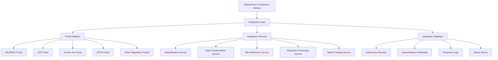

### Key Integration Requirements

1. **Secure Authentication**: Implement secure authentication mechanisms for each government portal
2. **Data Transformation**: Convert internal data models to portal-specific formats
3. **Document Format Compliance**: Ensure all submitted documents comply with portal requirements
4. **Reliable Submission**: Implement robust submission protocols with retry mechanisms
5. **Comprehensive Tracking**: Track submission status and responses
6. **Acknowledgment Processing**: Handle and store acknowledgments and confirmations
7. **Error Handling**: Implement specific error handling for each portal type
8. **Audit Trail**: Maintain detailed logs of all portal interactions

## Integration Architecture

### 1. Portal Adapter Pattern

The system will use a portal adapter pattern to abstract the complexities of each government portal:

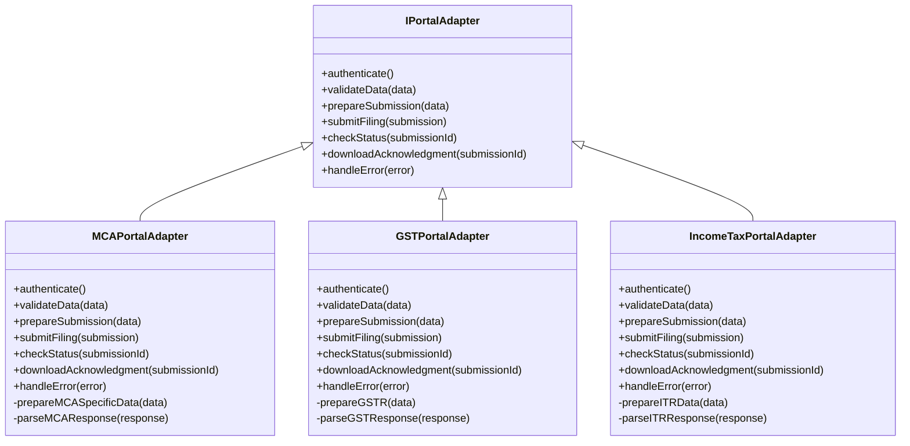

Each portal adapter implements a common interface but encapsulates portal-specific logic, authentication mechanisms, data formats, and error handling.

### 2. Integration Flow

The typical integration flow follows this sequence:

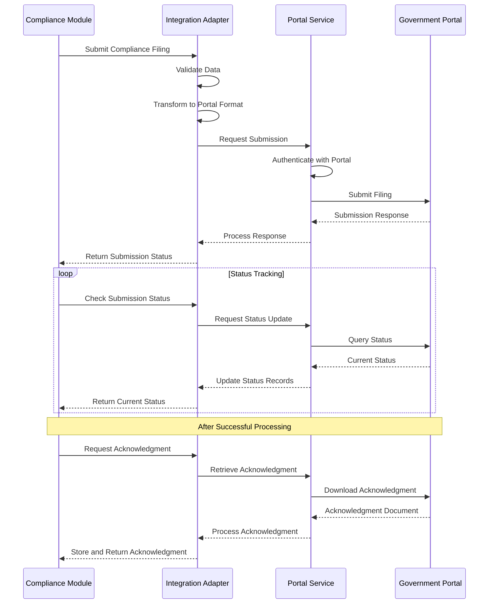

### 3. Authentication Mechanisms

Different government portals use various authentication methods:

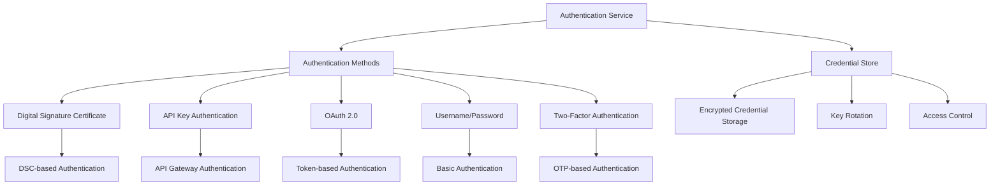

#### Portal-Specific Authentication:

1. **MCA/ROC Portal**
   - Digital Signature Certificate (DSC) based authentication
   - Role-based access with registered DSCs
   - Session management with token-based access

2. **GST Portal**
   - Username/Password with GST Practitioner credentials
   - API access via registered applications
   - DSC-based signature for certain submissions

3. **Income Tax Portal**
   - PAN-based authentication
   - e-Filing credentials
   - API-based access for registered services

### 4. Data Transformation Layer

The integration includes a robust data transformation layer:

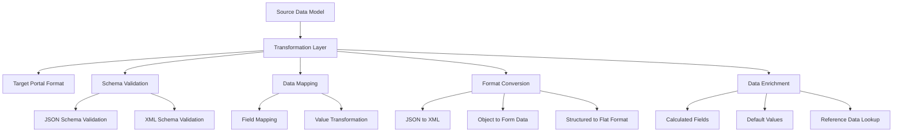

#### Transformation Examples:

**Example: MCA AOC-4 Transformation**

```json
// Internal Data Model
{
  "entityId": "60d21b4667d0d8992e610c89",
  "complianceId": "60d21b4667d0d8992e610c88",
  "financialYear": "2022-23",
  "financialData": {
    "revenue": 25000000,
    "expenses": 21000000,
    "netProfit": 4000000,
    "assets": 35000000,
    "liabilities": 15000000
  },
  "directors": [
    {
      "directorId": "DIR123456",
      "name": "John Doe",
      "din": "12345678",
      "designation": "Managing Director"
    }
    // Other directors...
  ]
}

// Transformed for MCA Portal (XML)
<AOC4Filing>
  <CompanyDetails>
    <CIN>U12345MH2020PTC123456</CIN>
    <CompanyName>XYZ Private Limited</CompanyName>
    <ROCCode>RoC-Mumbai</ROCCode>
    <FinancialYearFrom>01/04/2022</FinancialYearFrom>
    <FinancialYearTo>31/03/2023</FinancialYearTo>
  </CompanyDetails>
  <FinancialStatements>
    <Revenue>25000000</Revenue>
    <Expenses>21000000</Expenses>
    <ProfitBeforeTax>4000000</ProfitBeforeTax>
    <TaxAmount>1000000</TaxAmount>
    <ProfitAfterTax>3000000</ProfitAfterTax>
    <TotalAssets>35000000</TotalAssets>
    <TotalLiabilities>15000000</TotalLiabilities>
    <ShareCapital>10000000</ShareCapital>
    <Reserves>10000000</Reserves>
  </FinancialStatements>
  <DirectorDetails>
    <Director>
      <DIN>12345678</DIN>
      <Name>John Doe</Name>
      <Designation>Managing Director</Designation>
      <DateOfSignature>25/05/2023</DateOfSignature>
    </Director>
    <!-- Other directors... -->
  </DirectorDetails>
</AOC4Filing>
```

**Example: GST Return Transformation**

```json
// Internal Data Model
{
  "entityId": "60d21b4667d0d8992e610c89",
  "complianceId": "60d21b4667d0d8992e610c90",
  "gstRegistration": "27AADCB2230M1ZR",
  "returnPeriod": "052023", // May 2023
  "returnType": "GSTR-3B",
  "transactions": {
    "outwardSupplies": {
      "taxableValue": 1500000,
      "igstAmount": 270000,
      "cgstAmount": 0,
      "sgstAmount": 0
    },
    "inwardSupplies": {
      "taxableValue": 800000,
      "igstAmount": 144000,
      "cgstAmount": 0,
      "sgstAmount": 0
    }
    // Other transaction details...
  }
}

// Transformed for GST Portal (JSON)
{
  "gstin": "27AADCB2230M1ZR",
  "ret_period": "052023",
  "sup_details": {
    "osup_det": {
      "txval": 1500000,
      "iamt": 270000,
      "camt": 0,
      "samt": 0,
      "csamt": 0
    },
    "isup_rev": {
      "txval": 0,
      "iamt": 0,
      "camt": 0,
      "samt": 0,
      "csamt": 0
    }
  },
  "itc_elg": {
    "itc_avl": [
      {
        "ty": "IMPS",
        "iamt": 144000,
        "camt": 0,
        "samt": 0,
        "csamt": 0
      }
    ]
  }
  // Other GST Portal specific fields...
}
```

### 5. Portal-Specific Integration Details

#### 5.1 MCA/ROC Portal Integration

The MCA portal integration facilitates submission of company filings:

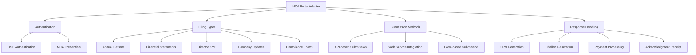

**Key MCA Forms Supported:**

1. **Form AOC-4**: Annual Financial Statements
2. **Form MGT-7**: Annual Return
3. **Form DIR-3 KYC**: Director KYC
4. **Form INC-20A**: Commencement of Business
5. **Form INC-22A**: Active Company Tagging
6. **Form MGT-14**: Filing of Resolutions
7. **Form ADT-1**: Auditor Appointment

**MCA-Specific Integration Challenges:**

1. **DSC Authentication**: Managing and using Digital Signature Certificates
2. **Form Structure Changes**: Handling frequent updates to form structures
3. **Pre-fill Data**: Pre-filling data from MCA database
4. **SRN Tracking**: Tracking Service Request Numbers through processing stages
5. **Payment Integration**: Handling challan generation and payment verification

#### 5.2 GST Portal Integration

The GST portal integration handles GST return filings:

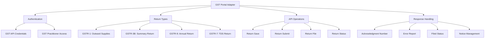

**GST-Specific Integration Challenges:**

1. **API Evolution**: Handling GST API updates and versioning
2. **Data Validation**: Complex validation rules for GST returns
3. **Invoice Reconciliation**: Matching with GSTR-2A/2B data
4. **Error Handling**: Processing detailed error reports
5. **Notice Management**: Handling notices and amendments

#### 5.3 Income Tax Portal Integration

The Income Tax portal integration handles tax filings:

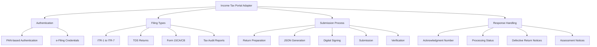

**Income Tax-Specific Integration Challenges:**

1. **Schema Complexity**: Handling complex ITR schemas
2. **Verification Methods**: Supporting multiple verification methods (DSC, Aadhaar OTP, etc.)
3. **Processing Status**: Tracking multi-stage processing status
4. **Notice Management**: Handling defective return notices and responses
5. **Pre-fill Data**: Integrating with pre-fill data from the IT department

### 6. Submission Management

The integration layer includes a robust submission management system:

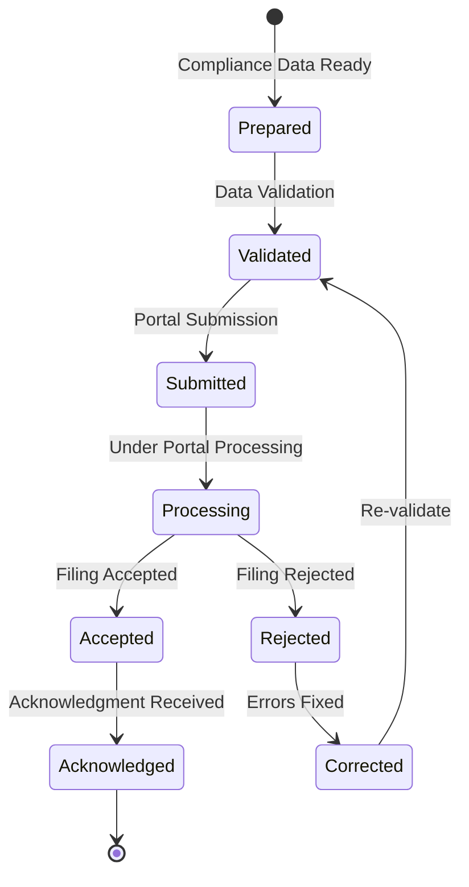

#### Submission Record Schema

```json
{
  "submissionId": "SUB12345678",
  "entityId": "60d21b4667d0d8992e610c89",
  "complianceId": "60d21b4667d0d8992e610c88",
  "portalType": "MCA_PORTAL",
  "formType": "AOC-4",
  "financialYear": "2022-23",
  "submissionStatus": "ACKNOWLEDGED",
  "submissionTimeline": {
    "prepared": "2023-05-01T10:00:00Z",
    "validated": "2023-05-01T10:15:00Z",
    "submitted": "2023-05-01T10:30:00Z",
    "processed": "2023-05-02T14:00:00Z",
    "acknowledged": "2023-05-02T14:15:00Z"
  },
  "portalReferenceIds": {
    "srn": "T12345678",
    "challanId": "CH12345678",
    "acknowledgmentId": "ACK12345678"
  },
  "submittedBy": "60d21b4667d0d8992e610c91",
  "submissionData": {
    "dataHash": "6d8f1c2e3b7a9d0e4f5c2b1a8d7e6f5c",
    "dataSnapshotId": "SNAP12345678"
  },
  "responses": [
    {
      "timestamp": "2023-05-01T10:30:15Z",
      "status": "RECEIVED",
      "message": "Filing received for processing",
      "referenceId": "T12345678"
    },
    {
      "timestamp": "2023-05-02T14:00:00Z",
      "status": "PROCESSED",
      "message": "Filing processed successfully",
      "referenceId": "CH12345678"
    }
  ],
  "acknowledgment": {
    "receivedAt": "2023-05-02T14:15:00Z",
    "acknowledgmentNumber": "ACK12345678",
    "documentId": "60d21b4667d0d8992e610d05"
  },
  "errors": [],
  "retryHistory": []
}
```

### 7. Error Handling and Retry Mechanisms

The integration layer implements comprehensive error handling:

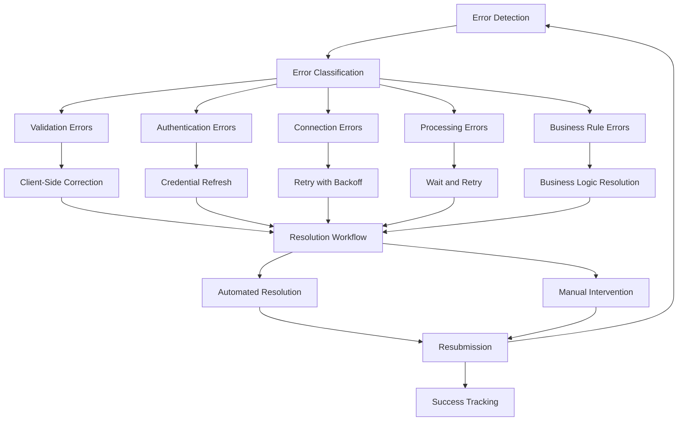

#### Error Classification and Handling:

1. **Validation Errors**
   - Pre-submission data validation failures
   - Form-specific validation rules
   - Automatic correction of common issues
   - Detailed error reporting for manual resolution

2. **Authentication Errors**
   - Expired credentials
   - Invalid DSC
   - Session timeouts
   - Automatic retry with credential refresh

3. **Connection Errors**
   - Network timeouts
   - Service unavailability
   - Exponential backoff retry mechanism
   - Circuit breaker pattern implementation

4. **Processing Errors**
   - Portal internal errors
   - Temporary service disruptions
   - Scheduled retry based on error type
   - Status polling to confirm resolution

5. **Business Rule Errors**
   - Regulatory rule violations
   - Business logic conflicts
   - Detailed error analysis
   - Guided resolution workflow

### 8. Monitoring and Logging

The integration includes comprehensive monitoring:

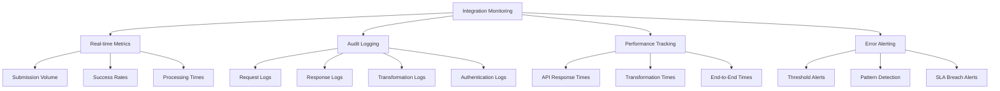

#### Key Monitoring Components:

1. **Portal Health Dashboard**
   - Real-time status of each government portal
   - Historical availability metrics
   - Planned maintenance schedule integration
   - Response time trends

2. **Submission Analytics**
   - Submission volumes by portal and form type
   - Success/failure rates
   - Common error patterns
   - Processing time averages

3. **Compliance Officer Alerts**
   - Critical failure notifications
   - SLA breach warnings
   - Escalation notifications
   - Resolution recommendations

### 9. Scalability and Performance

The integration architecture incorporates these scalability features:

1. **Asynchronous Processing**
   - Queue-based submission processing
   - Background status checking
   - Non-blocking operations

2. **Load Distribution**
   - Portal-specific rate limiting
   - Time-based submission distribution
   - Priority-based queue management

3. **Resource Optimization**
   - Connection pooling
   - Reuse of authentication sessions
   - Caching of reference data

4. **Horizontal Scaling**
   - Stateless adapter instances
   - Distributed processing capability
   - Load-balanced API endpoints

### 10. Security Considerations

The integration implements these security measures:

1. **Credential Protection**
   - Encrypted credential storage
   - Restricted access to portal credentials
   - Just-in-time credential access

2. **Data Protection**
   - End-to-end encryption for sensitive data
   - Data minimization in logs
   - Secure storage of submission snapshots

3. **Access Control**
   - Role-based access to integration functions
   - Action-level permissions for portal operations
   - Audit trails for all credential usage

4. **Compliance Tracking**
   - Regulatory requirement mapping
   - Compliance status monitoring
   - Security control documentation

## Implementation Roadmap

### Phase 1: Core Integration Framework

1. **Integration Architecture Setup**
   - Portal adapter framework
   - Authentication service
   - Basic monitoring and logging

2. **MCA Portal Integration**
   - DSC integration
   - AOC-4 and MGT-7 submissions
   - SRN tracking

### Phase 2: Extended Portal Support

1. **GST Portal Integration**
   - GSTR-1 and GSTR-3B submissions
   - Invoice data integration
   - Status tracking

2. **Income Tax Portal Integration**
   - ITR filing for companies
   - TDS return filing
   - Acknowledgment processing

### Phase 3: Advanced Features

1. **Advanced Error Handling**
   - Pattern-based error resolution
   - Predictive validation
   - Automated correction suggestions

2. **Performance Optimization**
   - Caching strategy implementation
   - Batch submission processing
   - Response time optimization

3. **Integration Dashboard**
   - Real-time portal status
   - Submission analytics
   - Error trend analysis