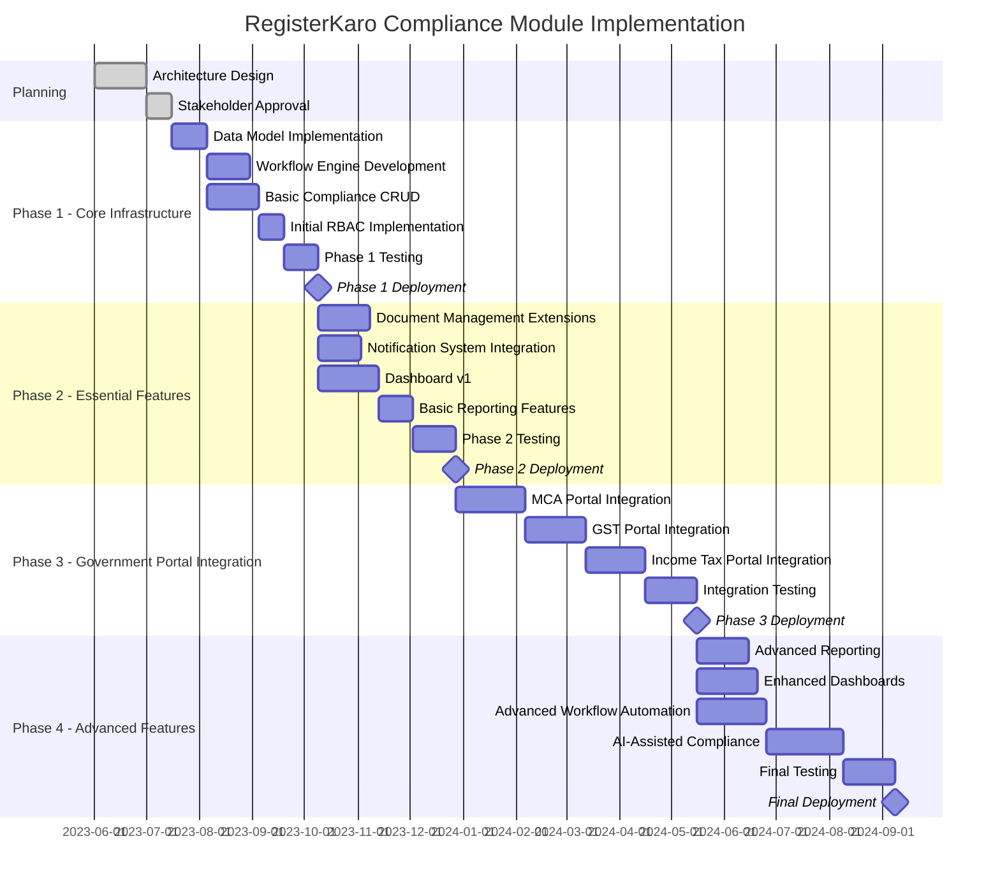

# Implementation Roadmap

This document outlines the phased approach for implementing the RegisterKaro Phase 2 Compliance Module. It provides a detailed timeline, resource allocation plan, dependencies, and milestones for each phase of development.

## Overall Timeline

## Phase 1: Core Infrastructure (90 days)

The first phase focuses on building the foundational components of the compliance module.

### Objectives

- Implement core data models and database schemas
- Develop basic compliance management CRUD operations
- Build workflow engine for compliance processes
- Implement initial RBAC framework
- Set up the testing environment and CI/CD pipelines

### Key Deliverables

1. **Compliance Data Models**
   - Entity Compliance schema
   - Compliance Type definitions
   - Compliance Schedule schema
   - Compliance Status tracking

2. **Workflow Engine Foundation**
   - Workflow definition framework
   - State transition management
   - Basic workflow execution

3. **Core Compliance APIs**
   - Compliance CRUD operations
   - Compliance assignment APIs
   - Status management endpoints
   - Basic search and filtering

4. **Initial RBAC Implementation**
   - Role definitions for compliance
   - Permission matrices
   - Access control enforcement

### Dependencies

- Existing entity management system
- User and role management system
- Authentication and authorization framework
- Document management system

### Team Allocation

- 2 Backend Developers (full-time)
- 1 Frontend Developer (part-time)
- 1 DevOps Engineer (part-time)
- 1 QA Engineer (part-time)

### Testing Strategy

- Unit tests for all core components (90% coverage)
- Integration tests for critical workflows
- API contract testing
- Performance testing for database operations

### Success Criteria

- All core data models implemented and validated
- Basic compliance management workflow functional
- RBAC system correctly enforcing access controls
- All unit and integration tests passing
- System able to handle basic compliance tracking

## Phase 2: Essential Features (110 days)

The second phase focuses on adding essential features required for effective compliance management.

### Objectives

- Extend document management system for compliance needs
- Integrate notification system for compliance alerts
- Develop basic dashboards and reporting
- Implement document verification workflows

### Key Deliverables

1. **Document Management Extensions**
   - Compliance document metadata
   - Document verification workflows
   - Compliance template management
   - Document retention rules

2. **Notification System Integration**
   - Compliance deadline notifications
   - Status change alerts
   - Escalation notifications
   - Notification preferences

3. **Basic Dashboards**
   - Entity compliance dashboard
   - Compliance officer dashboard
   - Deadline tracking views
   - Status summary visualizations

4. **Basic Reporting**
   - Compliance status reports
   - Deadline tracking reports
   - Document status reports
   - Export capabilities (PDF, Excel)

### Dependencies

- Phase 1 components
- Existing notification system
- Document storage infrastructure
- Frontend visualization libraries

### Team Allocation

- 2 Backend Developers (full-time)
- 2 Frontend Developers (full-time)
- 1 DevOps Engineer (part-time)
- 1 QA Engineer (full-time)
- 1 UI/UX Designer (part-time)

### Testing Strategy

- Unit tests for new components (90% coverage)
- Integration tests for notification workflows
- UI/UX testing for dashboards
- User acceptance testing for reporting features
- Load testing for notification system

### Success Criteria

- Document management extensions fully functional
- Notifications successfully delivered for compliance events
- Dashboards accurately displaying compliance data
- Reports generating correct information
- Positive feedback from user acceptance testing

## Phase 3: Government Portal Integration (140 days)

The third phase focuses on integration with government portals for electronic filings.

### Objectives

- Develop integration architecture for government portals
- Implement MCA/ROC portal integration
- Implement GST portal integration
- Implement Income Tax portal integration
- Build submission tracking and management

### Key Deliverables

1. **Integration Framework**
   - Portal adapter architecture
   - Authentication service
   - Data transformation layer
   - Submission management
   - Error handling and retry mechanisms

2. **MCA/ROC Portal Integration**
   - DSC-based authentication
   - Form AOC-4 submission
   - Form MGT-7 submission
   - Form DIR-3 KYC submission
   - SRN tracking and acknowledgment processing

3. **GST Portal Integration**
   - GST credential management
   - GSTR-1 submission
   - GSTR-3B submission
   - GSTR-9 submission
   - Invoice data integration

4. **Income Tax Portal Integration**
   - Income Tax authentication
   - ITR filing for companies
   - TDS return submission
   - Form 15CA/CB submissions
   - Acknowledgment processing

### Dependencies

- Phase 1 and 2 components
- Digital Signature Certificate infrastructure
- Government portal API specifications
- Secure credential management system

### Team Allocation

- 3 Backend Developers (full-time)
- 1 Frontend Developer (full-time)
- 1 Integration Specialist (full-time)
- 1 Security Engineer (part-time)
- 1 DevOps Engineer (part-time)
- 2 QA Engineers (full-time)

### Testing Strategy

- Unit tests for adapter components
- Mock-based integration testing
- Security testing for credential management
- Sandbox testing with government portals
- End-to-end submission testing
- Error scenario testing
- Performance testing under load

### Success Criteria

- Successful end-to-end submissions to each portal
- Proper handling of portal responses and errors
- Accurate tracking of submission status
- Secure management of credentials
- All integration tests passing
- Performance meeting requirements under load

## Phase 4: Advanced Features (150 days)

The fourth phase focuses on advanced features to enhance the compliance module.

### Objectives

- Develop advanced reporting and analytics
- Enhance dashboards with additional visualizations
- Implement advanced workflow automation
- Add AI-assisted compliance features
- Optimize performance and scalability

### Key Deliverables

1. **Advanced Reporting**
   - Custom report builder
   - Scheduled report generation
   - Advanced data visualization
   - Multi-format export options
   - Report distribution system

2. **Enhanced Dashboards**
   - Executive dashboard
   - Predictive compliance insights
   - Comparative analytics
   - Trend analysis
   - Custom dashboard builder

3. **Advanced Workflow Automation**
   - Dynamic workflow generation
   - Conditional process branching
   - Automated document generation
   - Intelligent task assignment
   - SLA monitoring and enforcement

4. **AI-Assisted Compliance**
   - Document content extraction
   - Automated form filling
   - Compliance risk prediction
   - Anomaly detection
   - Regulatory update monitoring

### Dependencies

- All previous phase components
- Machine learning infrastructure
- Advanced analytics libraries
- Data warehouse for historical analysis

### Team Allocation

- 2 Backend Developers (full-time)
- 2 Frontend Developers (full-time)
- 1 Data Scientist (full-time)
- 1 Machine Learning Engineer (full-time)
- 1 DevOps Engineer (part-time)
- 2 QA Engineers (full-time)
- 1 Performance Engineer (part-time)

### Testing Strategy

- Unit and integration tests for new components
- Performance testing for reporting and dashboards
- Accuracy testing for AI components
- User acceptance testing for advanced features
- Scalability testing
- Security penetration testing

### Success Criteria

- Advanced reporting features functioning correctly
- Enhanced dashboards providing valuable insights
- Workflow automation handling complex scenarios
- AI-assisted features demonstrating accuracy
- Performance metrics meeting targets
- Positive user feedback on advanced features

## Risk Management

### Identified Risks

1. **Government Portal Changes**
   - Risk: Government portals frequently update APIs and form formats
   - Mitigation: Implement adapter pattern, monitor for changes, maintain sandbox testing

2. **Regulatory Compliance**
   - Risk: New compliance requirements may emerge during development
   - Mitigation: Flexible data model, regular regulatory reviews, agile development approach

3. **Integration Complexity**
   - Risk: Government portal integrations may be more complex than anticipated
   - Mitigation: Early prototyping, phased approach, dedicated integration specialists

4. **Performance Under Load**
   - Risk: System may face performance issues during peak filing periods
   - Mitigation: Load testing, performance optimization, scalable architecture

5. **Security Vulnerabilities**
   - Risk: Handling sensitive compliance data introduces security risks
   - Mitigation: Regular security audits, encryption, principle of least privilege

### Contingency Plans

1. **Schedule Contingency**
   - 15% buffer added to each phase timeline
   - Critical path analysis to identify potential bottlenecks
   - Ability to reprioritize features if necessary

2. **Resource Contingency**
   - Identification of backup resources for key roles
   - Cross-training team members on critical components
   - Budget for additional resources if needed

3. **Technical Contingency**
   - Alternative implementation approaches identified for high-risk components
   - Fallback solutions for critical integrations
   - Manual workarounds for automated processes

## Governance and Monitoring

### Project Governance

1. **Steering Committee**
   - Bi-weekly steering committee meetings
   - Key stakeholder representation
   - Go/no-go decision points at phase boundaries

2. **Development Process**
   - Agile development methodology
   - 2-week sprint cycles
   - Daily standups and weekly demos
   - Sprint planning and retrospectives

3. **Change Management**
   - Formal change request process
   - Impact analysis for proposed changes
   - Approval workflow for scope changes

### Progress Monitoring

1. **Key Performance Indicators**
   - Sprint velocity
   - Test coverage percentage
   - Defect density
   - Technical debt metrics
   - Milestone achievement rate

2. **Reporting**
   - Weekly status reports
   - Monthly executive summaries
   - Phase completion reports
   - Quality metrics dashboard

3. **Quality Gates**
   - Code review requirements
   - Test coverage thresholds
   - Performance benchmarks
   - Security scan clearance

## Post-Implementation

### Training and Adoption

1. **User Training**
   - Role-based training modules
   - Video tutorials and documentation
   - Hands-on workshops
   - Certification program for compliance officers

2. **Support Preparation**
   - Support team training
   - Knowledge base development
   - Troubleshooting guides
   - FAQ documentation

3. **Adoption Monitoring**
   - Usage analytics implementation
   - User feedback collection
   - Feature adoption tracking
   - Support ticket analysis

### Maintenance and Evolution

1. **Maintenance Plan**
   - Regular update schedule for portal adapters
   - Quarterly regulatory review
   - Performance monitoring and optimization
   - Security patch management

2. **Future Roadmap**
   - Additional portal integrations
   - Mobile application development
   - Advanced analytics capabilities
   - Regulatory intelligence features

## Resource Requirements

### Human Resources

| Role | Phase 1 | Phase 2 | Phase 3 | Phase 4 | Skills Required |
|------|---------|---------|---------|---------|-----------------|
| Backend Developer | 2 | 2 | 3 | 2 | Node.js, MongoDB, API development |
| Frontend Developer | 1 | 2 | 1 | 2 | React, Redux, D3.js |
| DevOps Engineer | 1 | 1 | 1 | 1 | CI/CD, Docker, AWS |
| QA Engineer | 1 | 1 | 2 | 2 | Automated testing, API testing |
| Integration Specialist | 0 | 0 | 1 | 0 | API integration, DSC knowledge |
| Security Engineer | 0 | 0 | 1 | 0 | Security best practices, encryption |
| Data Scientist | 0 | 0 | 0 | 1 | ML, data analysis, Python |
| UI/UX Designer | 0 | 1 | 0 | 0 | Dashboard design, UX principles |
| Performance Engineer | 0 | 0 | 0 | 1 | Performance testing, optimization |
| Project Manager | 1 | 1 | 1 | 1 | Agile methodology, compliance domain |

### Infrastructure Requirements

1. **Development Environment**
   - Development servers
   - CI/CD pipeline
   - Test environment
   - Code repository

2. **Production Environment**
   - Application servers
   - Database clusters
   - Load balancers
   - Backup and recovery systems

3. **Security Infrastructure**
   - HSM for DSC management
   - Encryption services
   - Identity and access management
   - Security monitoring tools

4. **Third-Party Services**
   - Government portal sandbox access
   - DSC provider integration
   - Notification delivery services
   - Analytics and monitoring services

## Budget Estimation

| Category | Phase 1 | Phase 2 | Phase 3 | Phase 4 | Total |
|----------|---------|---------|---------|---------|-------|
| Personnel | $180,000 | $250,000 | $350,000 | $380,000 | $1,160,000 |
| Infrastructure | $30,000 | $40,000 | $50,000 | $60,000 | $180,000 |
| Software Licenses | $15,000 | $25,000 | $35,000 | $45,000 | $120,000 |
| Third-Party Services | $10,000 | $20,000 | $60,000 | $50,000 | $140,000 |
| Training & Support | $5,000 | $15,000 | $25,000 | $35,000 | $80,000 |
| Contingency (15%) | $36,000 | $52,500 | $78,000 | $85,500 | $252,000 |
| **Total** | **$276,000** | **$402,500** | **$598,000** | **$655,500** | **$1,932,000** |

## Success Metrics

### Technical Metrics

1. **Performance**
   - API response time < 300ms for 95% of requests
   - Report generation < 5 seconds for standard reports
   - Dashboard loading time < 2 seconds
   - System capable of handling 100 concurrent users

2. **Quality**
   - Code coverage > 90% for all components
   - Zero critical or high security vulnerabilities
   - Defect density < 0.5 defects per 1000 lines of code
   - 99.9% system availability during business hours

3. **Integration**
   - 99% success rate for portal submissions
   - Average submission processing time < 5 minutes
   - Error rate < 1% for data transformations
   - 100% acknowledgment capture rate

### Business Metrics

1. **Compliance Efficiency**
   - 80% reduction in manual compliance tasks
   - 50% reduction in compliance processing time
   - 99% on-time filing rate for managed compliances
   - 75% reduction in compliance-related queries

2. **User Adoption**
   - 90% feature adoption within 6 months
   - User satisfaction score > 4.2/5
   - Training completion rate > 95%
   - Self-service rate > 80%

3. **Business Impact**
   - Zero penalties due to missed compliance deadlines
   - 30% increase in compliance service revenue
   - 25% reduction in compliance management costs
   - 95% client retention rate

## Conclusion

This implementation roadmap provides a comprehensive plan for the development and deployment of the RegisterKaro Phase 2 Compliance Module. By following this phased approach, the project can deliver incremental value while managing risks and ensuring quality. The roadmap remains flexible to accommodate changing requirements and unforeseen challenges.

Regular reviews of this roadmap should be conducted to ensure alignment with business objectives and to incorporate lessons learned during implementation. The success of this project will be measured not only by the technical delivery but also by the business impact and user adoption of the compliance module.