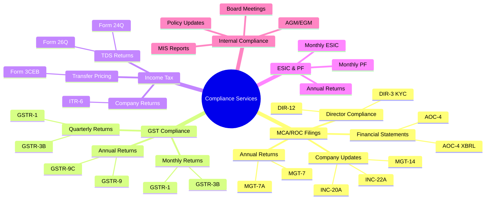
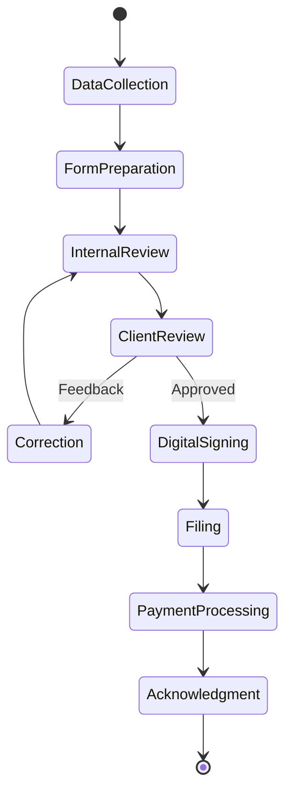
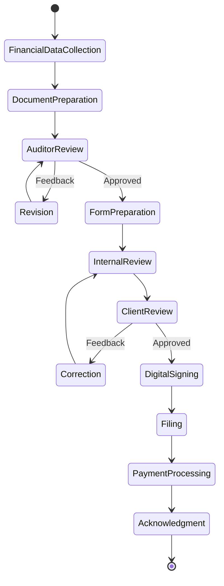
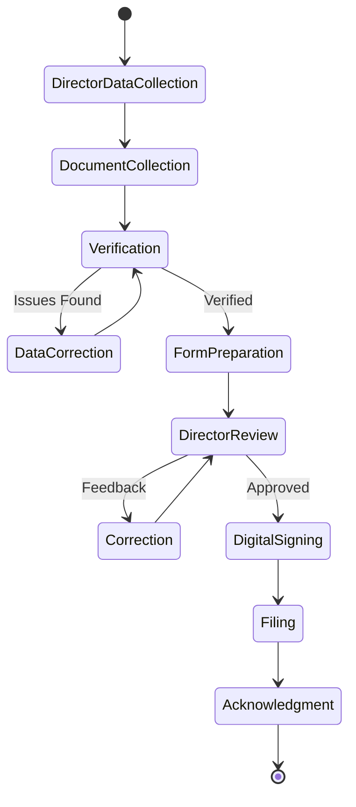
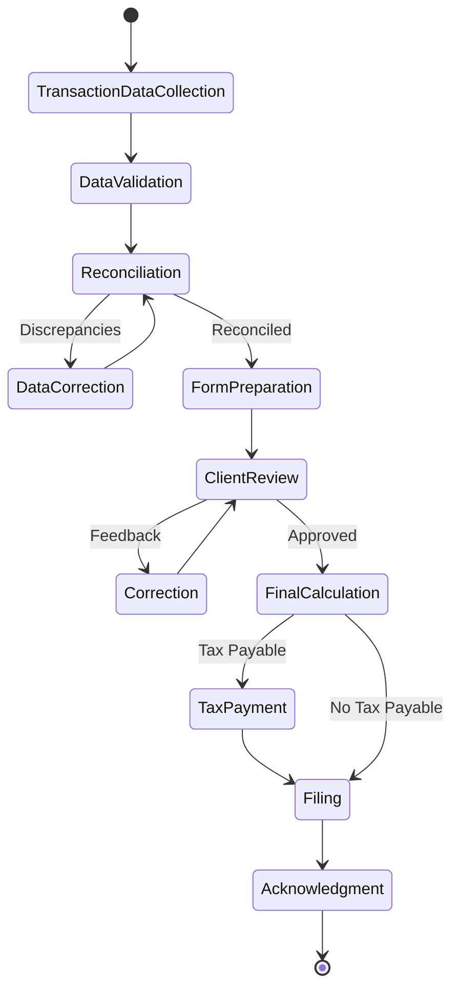
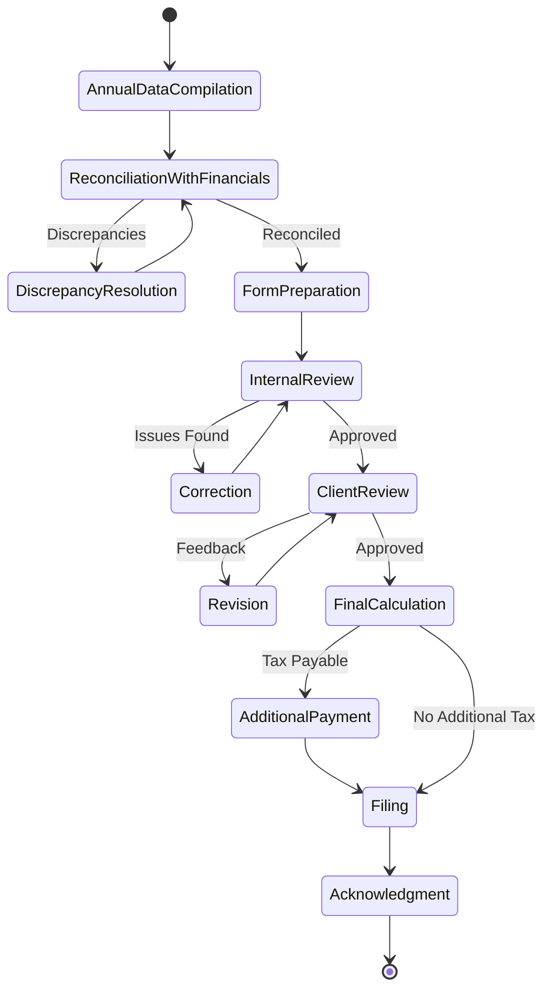
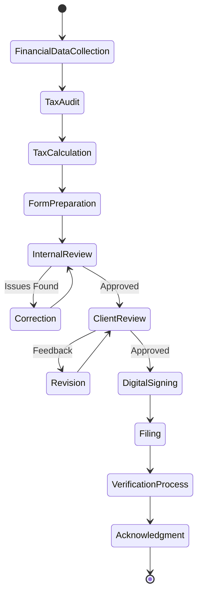
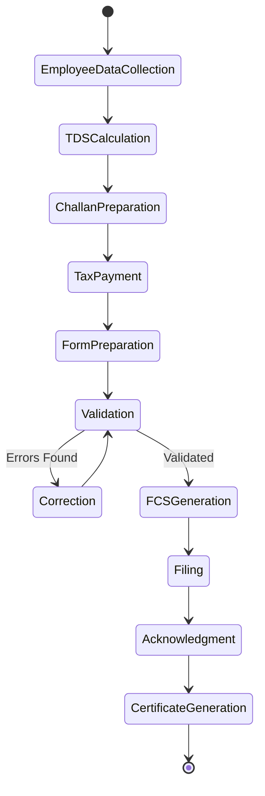

# Compliance Service Specifications

This document details the specific compliance services that will be offered through the RegisterKaro Phase 2 Compliance Module. Each service specification includes regulatory requirements, document needs, processing workflows, and implementation details.

## Overview of Compliance Service Types

The compliance module will support the following categories of compliance services:



## MCA/ROC Filings

### 1. Annual Return (MGT-7)

**Description**: Annual return providing details of the company's shareholders, directors, and other key information for the financial year.

**Regulatory Framework**:
- Companies Act, 2013 - Section 92
- Companies (Management and Administration) Rules, 2014

**Filing Timeline**:
- Due within 60 days from the date of Annual General Meeting (AGM)
- AGM must be held within 6 months from the end of the financial year
- For most companies: Due by November 29th (for FY ending March 31st)

**Required Information**:
- Company registration details
- Share capital structure
- List of shareholders with changes during the year
- List of directors and key managerial personnel
- Details of meetings (Board, AGM, EGM)
- Remuneration details of directors and key managerial personnel
- Penalties or punishments imposed on the company
- CSR compliance details (if applicable)

**Required Documents**:
- Board resolution or Extract of minutes of AGM
- List of shareholders in specified format
- Details of foreign shareholders (if any)
- Optional attachment for additional information

**Workflow Specification**:



**Service Implementation Details**:

1. **Data Collection**
   - API integration with entity management system
   - Automated data collection for returning clients
   - Interactive form for new data input
   - Document upload system for supporting documents

2. **Form Preparation**
   - MGT-7 template with auto-fill capability
   - Validation against MCA business rules
   - Error detection and suggestions
   - Version control for form drafts

3. **Review Process**
   - Multi-level review workflow
   - Comparison with previous year's data
   - Change highlighting for client review
   - Digital annotation and comments

4. **Digital Signing**
   - DSC integration for authorized signatories
   - DSC verification before signing
   - Timestamp and signature verification
   - Multiple signatory support if required

5. **MCA Portal Submission**
   - Direct integration with MCA portal
   - SRN generation and tracking
   - Payment processing
   - Acknowledgment retrieval and storage

**Data Model Extensions**:

```json
{
  "complianceType": "MCA_ANNUAL_RETURN",
  "formType": "MGT-7",
  "entityId": "60d21b4667d0d8992e610c89",
  "financialYear": "2022-23",
  "dueDate": "2023-11-29T23:59:59Z",
  "agmDate": "2023-09-30T11:00:00Z",
  "status": "PENDING",
  "assignedTo": "60d21b4667d0d8992e610c91",
  "metadata": {
    "shareCapitalChanges": false,
    "directorChanges": true,
    "foreignShareholders": false,
    "csrApplicable": true
  },
  "documentRequirements": [
    {
      "documentType": "BOARD_RESOLUTION",
      "required": true,
      "status": "PENDING"
    },
    {
      "documentType": "SHAREHOLDER_LIST",
      "required": true,
      "status": "PENDING"
    },
    {
      "documentType": "AGM_MINUTES",
      "required": true,
      "status": "PENDING"
    }
  ],
  "workflowState": "DATA_COLLECTION",
  "filingDetails": {
    "srn": null,
    "submissionDate": null,
    "acknowledgmentNumber": null,
    "paymentReference": null
  }
}
```

### 2. Financial Statements Filing (AOC-4)

**Description**: Annual filing of financial statements including balance sheet, profit and loss account, and related documents.

**Regulatory Framework**:
- Companies Act, 2013 - Section 137
- Companies (Accounts) Rules, 2014

**Filing Timeline**:
- Due within 30 days from the date of Annual General Meeting (AGM)
- For most companies: Due by October 30th (for FY ending March 31st)

**Required Information**:
- Company registration details
- Board report
- Financial statements (Balance Sheet, P&L, Cash Flow)
- Notes to accounts
- Auditor's report
- Director's report
- CSR report (if applicable)

**Required Documents**:
- Audited financial statements
- Board report
- Auditor's report
- CSR report (if applicable)
- Other attachments as applicable

**Workflow Specification**:



**Service Implementation Details**:

1. **Financial Data Collection**
   - Structured data input for financial statements
   - Document upload for existing financial statements
   - Data extraction from uploaded documents
   - Validation against accounting rules

2. **Form Preparation**
   - AOC-4 template with auto-fill capability
   - XBRL conversion for eligible companies
   - Business rule validation
   - Error detection and correction

3. **Review Process**
   - Multi-level review workflow
   - Financial data validation
   - Comparison with previous year's data
   - Auditor-specific review process

4. **Digital Signing**
   - DSC integration for directors and auditors
   - Multiple signatory workflow
   - Role-based signing sequence
   - Signature verification

5. **MCA Portal Submission**
   - Direct integration with MCA portal
   - XBRL validation before submission
   - Payment processing
   - Acknowledgment retrieval and storage

**Data Model Extensions**:

```json
{
  "complianceType": "MCA_FINANCIAL_STATEMENTS",
  "formType": "AOC-4",
  "xbrlRequired": true,
  "entityId": "60d21b4667d0d8992e610c89",
  "financialYear": "2022-23",
  "dueDate": "2023-10-30T23:59:59Z",
  "agmDate": "2023-09-30T11:00:00Z",
  "status": "PENDING",
  "assignedTo": "60d21b4667d0d8992e610c91",
  "metadata": {
    "turnover": 25000000,
    "paidUpCapital": 10000000,
    "netProfit": 3000000,
    "auditRequired": true
  },
  "documentRequirements": [
    {
      "documentType": "BALANCE_SHEET",
      "required": true,
      "status": "PENDING"
    },
    {
      "documentType": "PROFIT_LOSS_STATEMENT",
      "required": true,
      "status": "PENDING"
    },
    {
      "documentType": "AUDITOR_REPORT",
      "required": true,
      "status": "PENDING"
    },
    {
      "documentType": "DIRECTORS_REPORT",
      "required": true,
      "status": "PENDING"
    }
  ],
  "signatoryRequirements": [
    {
      "role": "DIRECTOR",
      "required": true,
      "count": 1,
      "status": "PENDING"
    },
    {
      "role": "AUDITOR",
      "required": true,
      "count": 1,
      "status": "PENDING"
    }
  ],
  "workflowState": "FINANCIAL_DATA_COLLECTION",
  "filingDetails": {
    "srn": null,
    "submissionDate": null,
    "acknowledgmentNumber": null,
    "paymentReference": null
  }
}
```

### 3. Director's KYC (DIR-3 KYC)

**Description**: Annual KYC filing required for all directors to verify their identity and contact details.

**Regulatory Framework**:
- Companies Act, 2013
- Companies (Appointment and Qualification of Directors) Rules, 2014 - Rule 12A

**Filing Timeline**:
- Due by September 30th every year
- Late filing penalty: ₹5,000

**Required Information**:
- Director's personal details
- Contact information
- Residential address
- ID proof details
- Photograph
- Digital signature

**Required Documents**:
- Proof of identity
- Proof of address
- Passport-sized photograph
- Digital Signature Certificate (DSC)

**Workflow Specification**:



**Service Implementation Details**:

1. **Director Data Collection**
   - API integration with entity management system
   - Centralized director database
   - Automated notifications to directors
   - Secure data collection portal

2. **Document Collection**
   - Secure document upload system
   - Document validation and verification
   - Automatic document classification
   - Expiry tracking for documents

3. **Form Preparation**
   - DIR-3 KYC template with auto-fill capability
   - Pre-fill from existing director database
   - Validation against MCA requirements
   - Mobile-friendly interface for director input

4. **Digital Signing**
   - Direct integration with director's DSC
   - Mobile-based signing options
   - OTP-based verification alternatives
   - Guided DSC installation process

5. **MCA Portal Submission**
   - Direct integration with MCA portal
   - Batch processing for multiple directors
   - Status tracking and notifications
   - Acknowledgment retrieval and storage

**Data Model Extensions**:

```json
{
  "complianceType": "DIRECTOR_KYC",
  "formType": "DIR-3_KYC",
  "personId": "60d21b4667d0d8992e610c92",
  "directorDIN": "12345678",
  "financialYear": "2022-23",
  "dueDate": "2023-09-30T23:59:59Z",
  "status": "PENDING",
  "assignedTo": "60d21b4667d0d8992e610c91",
  "metadata": {
    "firstTimeKYC": false,
    "foreignDirector": false,
    "addressChanged": true,
    "contactDetailsChanged": false
  },
  "documentRequirements": [
    {
      "documentType": "IDENTITY_PROOF",
      "required": true,
      "status": "PENDING"
    },
    {
      "documentType": "ADDRESS_PROOF",
      "required": true,
      "status": "PENDING"
    },
    {
      "documentType": "PHOTOGRAPH",
      "required": true,
      "status": "PENDING"
    }
  ],
  "contactVerification": {
    "emailVerified": false,
    "mobileVerified": false
  },
  "workflowState": "DIRECTOR_DATA_COLLECTION",
  "filingDetails": {
    "submissionDate": null,
    "acknowledgmentNumber": null
  }
}
```

## GST Compliance

### 1. Monthly GSTR-3B

**Description**: Monthly summary return showing the summary of outward supplies, inward supplies, ITC claimed, and tax payment.

**Regulatory Framework**:
- Central Goods and Services Tax Act, 2017
- CGST Rules, 2017

**Filing Timeline**:
- Due by 20th of the following month
- Large taxpayers (turnover > ₹5 crore): Due by 20th
- Small taxpayers (turnover ≤ ₹5 crore): Due by 22nd or 24th based on state

**Required Information**:
- Summary of outward supplies and tax liability
- Summary of inward supplies eligible for ITC
- Summary of inward supplies ineligible for ITC
- Tax payment details
- Interest and late fee details (if applicable)

**Required Documents**:
- Sales register for the month
- Purchase register for the month
- ITC register
- Tax payment challans (if paid separately)

**Workflow Specification**:



**Service Implementation Details**:

1. **Transaction Data Collection**
   - API integration with accounting systems
   - Bulk data import from Excel/CSV
   - Automated data extraction from sales/purchase registers
   - Real-time data validation

2. **Reconciliation**
   - Purchase data matching with GSTR-2A/2B
   - ITC eligibility validation
   - Discrepancy identification and resolution
   - Audit trail for reconciliation adjustments

3. **Form Preparation**
   - GSTR-3B template with auto-fill capability
   - Tax calculation and verification
   - Comparison with previous returns
   - Error checking and validation

4. **Tax Payment**
   - Challan generation
   - Payment gateway integration
   - Payment verification
   - Receipt management

5. **GST Portal Submission**
   - Direct integration with GST portal
   - API-based submission
   - Status tracking
   - Acknowledgment retrieval and storage

**Data Model Extensions**:

```json
{
  "complianceType": "GST_RETURN",
  "formType": "GSTR-3B",
  "entityId": "60d21b4667d0d8992e610c89",
  "gstin": "27AADCB2230M1ZR",
  "returnPeriod": "052023",
  "dueDate": "2023-06-20T23:59:59Z",
  "status": "PENDING",
  "assignedTo": "60d21b4667d0d8992e610c91",
  "metadata": {
    "turnoverCategory": "LARGE",
    "monthlyTurnover": 2500000,
    "regularTaxpayer": true,
    "compositionScheme": false
  },
  "taxLiability": {
    "outwardSupplies": {
      "taxableValue": 2000000,
      "igstAmount": 0,
      "cgstAmount": 180000,
      "sgstAmount": 180000,
      "cessAmount": 0
    },
    "inwardSupplies": {
      "reverseChargeValue": 0,
      "igstAmount": 0,
      "cgstAmount": 0,
      "sgstAmount": 0,
      "cessAmount": 0
    }
  },
  "inputTaxCredit": {
    "eligible": {
      "igstAmount": 50000,
      "cgstAmount": 100000,
      "sgstAmount": 100000,
      "cessAmount": 0
    },
    "ineligible": {
      "igstAmount": 5000,
      "cgstAmount": 10000,
      "sgstAmount": 10000,
      "cessAmount": 0
    }
  },
  "taxPayment": {
    "fromITC": {
      "igstAmount": 0,
      "cgstAmount": 100000,
      "sgstAmount": 100000,
      "cessAmount": 0
    },
    "inCash": {
      "igstAmount": 0,
      "cgstAmount": 80000,
      "sgstAmount": 80000,
      "cessAmount": 0
    }
  },
  "documentRequirements": [
    {
      "documentType": "SALES_REGISTER",
      "required": true,
      "status": "PENDING"
    },
    {
      "documentType": "PURCHASE_REGISTER",
      "required": true,
      "status": "PENDING"
    }
  ],
  "workflowState": "TRANSACTION_DATA_COLLECTION",
  "filingDetails": {
    "submissionDate": null,
    "acknowledgmentNumber": null,
    "challanDetails": null
  }
}
```

### 2. Annual GSTR-9

**Description**: Annual return summarizing all the supplies made/received and taxes paid/claimed in the financial year.

**Regulatory Framework**:
- Central Goods and Services Tax Act, 2017
- CGST Rules, 2017

**Filing Timeline**:
- Due by December 31st following the end of the financial year

**Required Information**:
- Annual summary of all outward supplies
- Annual summary of all inward supplies
- ITC claimed during the year
- Tax paid during the year
- Demands and refunds
- HSN summary of supplies

**Required Documents**:
- Monthly/quarterly GSTR-1 and GSTR-3B for the year
- Annual financial statements
- Tax payment challans for the year
- Credit and debit notes issued/received

**Workflow Specification**:



**Service Implementation Details**:

1. **Annual Data Compilation**
   - Automatic compilation from monthly/quarterly returns
   - Integration with historical return data
   - Data aggregation and classification
   - Variance analysis with financial statements

2. **Reconciliation**
   - Turnover reconciliation with financial statements
   - Tax liability reconciliation
   - ITC reconciliation
   - Identification of adjustments needed

3. **Form Preparation**
   - GSTR-9 template with auto-fill capability
   - Table-wise data population
   - Adjustment handling
   - Additional liability calculation

4. **Review Process**
   - Multi-level review workflow
   - Comparison with financial statements
   - Auditor review integration (if applicable)
   - Error checking and validation

5. **GST Portal Submission**
   - Direct integration with GST portal
   - API-based submission
   - Status tracking
   - Acknowledgment retrieval and storage

**Data Model Extensions**:

```json
{
  "complianceType": "GST_ANNUAL_RETURN",
  "formType": "GSTR-9",
  "entityId": "60d21b4667d0d8992e610c89",
  "gstin": "27AADCB2230M1ZR",
  "financialYear": "2022-23",
  "dueDate": "2023-12-31T23:59:59Z",
  "status": "PENDING",
  "assignedTo": "60d21b4667d0d8992e610c91",
  "metadata": {
    "annualTurnover": 30000000,
    "gstr9cRequired": false,
    "regularTaxpayer": true,
    "compositionScheme": false
  },
  "annualSummary": {
    "outwardSupplies": {
      "taxableValue": 30000000,
      "igstAmount": 1000000,
      "cgstAmount": 1350000,
      "sgstAmount": 1350000,
      "cessAmount": 0
    },
    "inwardSupplies": {
      "reverseChargeValue": 1000000,
      "igstAmount": 50000,
      "cgstAmount": 45000,
      "sgstAmount": 45000,
      "cessAmount": 0
    },
    "inputTaxCredit": {
      "availed": {
        "igstAmount": 800000,
        "cgstAmount": 1200000,
        "sgstAmount": 1200000,
        "cessAmount": 0
      },
      "reversed": {
        "igstAmount": 20000,
        "cgstAmount": 30000,
        "sgstAmount": 30000,
        "cessAmount": 0
      }
    },
    "taxPaid": {
      "igstAmount": 250000,
      "cgstAmount": 195000,
      "sgstAmount": 195000,
      "cessAmount": 0
    }
  },
  "reconciliationStatus": {
    "withFinancials": "PENDING",
    "withGSTR1": "PENDING",
    "withGSTR3B": "PENDING",
    "withITC": "PENDING"
  },
  "documentRequirements": [
    {
      "documentType": "ANNUAL_FINANCIAL_STATEMENTS",
      "required": true,
      "status": "PENDING"
    },
    {
      "documentType": "GSTR3B_SUMMARY",
      "required": true,
      "status": "PENDING"
    },
    {
      "documentType": "GSTR1_SUMMARY",
      "required": true,
      "status": "PENDING"
    },
    {
      "documentType": "RECONCILIATION_STATEMENT",
      "required": true,
      "status": "PENDING"
    }
  ],
  "workflowState": "ANNUAL_DATA_COMPILATION",
  "filingDetails": {
    "submissionDate": null,
    "acknowledgmentNumber": null,
    "additionalTaxPaid": null
  }
}
```

## Income Tax Compliance

### 1. Corporate Income Tax Return (ITR-6)

**Description**: Annual income tax return for companies reporting income, deductions, tax calculations, and tax payments.

**Regulatory Framework**:
- Income Tax Act, 1961
- Income Tax Rules, 1962

**Filing Timeline**:
- Due by October 31st following the end of the assessment year
- If transfer pricing applicable: Due by November 30th

**Required Information**:
- Company details and status
- Income from various sources
- Deductions and exemptions
- Tax calculation
- TDS/TCS/Advance tax details
- Balance sheet and P&L account
- Transfer pricing details (if applicable)

**Required Documents**:
- Audited financial statements
- Tax audit report (if applicable)
- Transfer pricing report (if applicable)
- TDS/TCS certificates
- Advance tax challans
- Form 10CCB, 10CCD, etc. (if applicable)

**Workflow Specification**:



**Service Implementation Details**:

1. **Financial Data Collection**
   - Integration with financial statements
   - Tax audit data incorporation
   - TDS/TCS certificate data extraction
   - Advance tax payment reconciliation

2. **Tax Calculation**
   - Income computation as per IT Act
   - Deduction eligibility verification
   - Applicable tax rate determination
   - Relief and rebate calculation

3. **Form Preparation**
   - ITR-6 template with auto-fill capability
   - Schedule-wise data population
   - XML generation for e-filing
   - Error checking and validation

4. **Review Process**
   - Multi-level review workflow
   - Comparison with previous year returns
   - Tax liability analysis
   - Optimization recommendations

5. **Income Tax Portal Submission**
   - Direct integration with Income Tax portal
   - DSC-based or EVC-based submission
   - Status tracking
   - Acknowledgment retrieval and storage

**Data Model Extensions**:

```json
{
  "complianceType": "INCOME_TAX_RETURN",
  "formType": "ITR-6",
  "entityId": "60d21b4667d0d8992e610c89",
  "pan": "AADCB2230M",
  "assessmentYear": "2023-24",
  "financialYear": "2022-23",
  "dueDate": "2023-10-31T23:59:59Z",
  "status": "PENDING",
  "assignedTo": "60d21b4667d0d8992e610c91",
  "metadata": {
    "turnover": 30000000,
    "taxAuditRequired": true,
    "transferPricingApplicable": false,
    "presumptiveTaxation": false
  },
  "incomeComputation": {
    "businessIncome": 3500000,
    "capitalGains": 500000,
    "otherSources": 200000,
    "totalIncome": 4200000,
    "deductions": 200000,
    "taxableIncome": 4000000
  },
  "taxComputation": {
    "taxOnRegularIncome": 1000000,
    "surcharge": 70000,
    "educationCess": 42800,
    "totalTaxLiability": 1112800,
    "tdsCredit": 800000,
    "advanceTaxPaid": 300000,
    "selfAssessmentTax": 12800,
    "refundDue": 0
  },
  "documentRequirements": [
    {
      "documentType": "FINANCIAL_STATEMENTS",
      "required": true,
      "status": "PENDING"
    },
    {
      "documentType": "TAX_AUDIT_REPORT",
      "required": true,
      "status": "PENDING"
    },
    {
      "documentType": "TDS_CERTIFICATES",
      "required": true,
      "status": "PENDING"
    },
    {
      "documentType": "ADVANCE_TAX_CHALLANS",
      "required": true,
      "status": "PENDING"
    }
  ],
  "workflowState": "FINANCIAL_DATA_COLLECTION",
  "filingDetails": {
    "submissionDate": null,
    "acknowledgmentNumber": null,
    "verificationMode": null
  }
}
```

### 2. TDS Return (Form 24Q)

**Description**: Quarterly return for TDS on salary, detailing tax deducted from employee salaries and deposited with the government.

**Regulatory Framework**:
- Income Tax Act, 1961 - Section 192
- Income Tax Rules, 1962

**Filing Timeline**:
- Q1 (Apr-Jun): Due by July 31st
- Q2 (Jul-Sep): Due by October 31st
- Q3 (Oct-Dec): Due by January 31st
- Q4 (Jan-Mar): Due by May 31st

**Required Information**:
- Deductor details
- Employee-wise salary and TDS details
- Challan details for tax deposited
- Late filing fee details (if applicable)

**Required Documents**:
- Salary registers
- TDS challan receipts
- Previous quarters' TDS certificates

**Workflow Specification**:



**Service Implementation Details**:

1. **Employee Data Collection**
   - Integration with payroll systems
   - Bulk employee data import