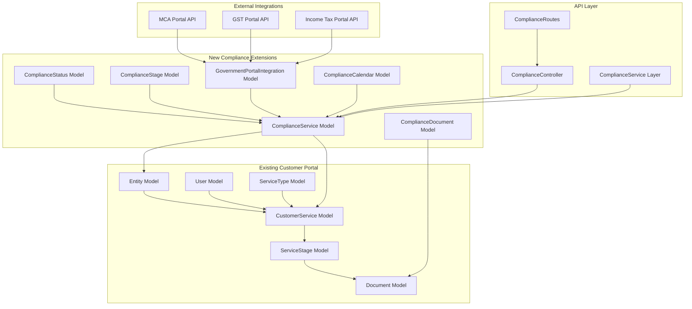
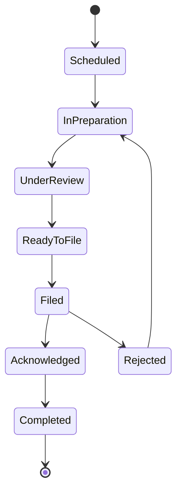

# Compliance Backend Integration Plan

## Overview

This document outlines the comprehensive plan for integrating compliance functionality into the existing customer portal backend. The integration follows established patterns from the current system while adding compliance-specific features.

## Architecture Overview



## Database Schema Extensions

### 1. ComplianceService Model

**Purpose**: Extends the service concept for compliance-specific workflows

**Key Features**:
- Links to existing Entity and CustomerService models
- Compliance-specific categorization and tracking
- Regulatory authority mapping
- Due date and penalty management
- Recurring compliance scheduling

**Schema Highlights**:
```javascript
{
  entityId: ObjectId (ref: Entity),
  customerServiceId: ObjectId (ref: CustomerService),
  complianceType: Enum[GST_FILING, INCOME_TAX_FILING, ROC_COMPLIANCE, ...],
  complianceCategory: Enum[PERIODIC_FILING, ANNUAL_COMPLIANCE, ...],
  regulatoryAuthority: Enum[GST_DEPARTMENT, MCA, INCOME_TAX_DEPARTMENT, ...],
  dueDate: Date,
  penaltyStructure: Object,
  isRecurring: Boolean,
  recurringPattern: Object
}
```

### 2. ComplianceStatus Model

**Purpose**: Manages compliance-specific status workflows

**Key Features**:
- Extends ApplicationStatus patterns
- Compliance-specific status types
- Automated status transitions
- Penalty and late fee tracking

**Schema Highlights**:
```javascript
{
  code: String (unique),
  complianceType: Enum[PENDING, FILED, APPROVED, REJECTED, ...],
  penaltyApplicable: Boolean,
  autoTransitionRules: Object,
  notificationTriggers: Object
}
```

### 3. ComplianceStage Model

**Purpose**: Defines compliance workflow stages

**Key Features**:
- Extends ServiceStage patterns
- Government portal integration points
- Document verification requirements
- Automated filing capabilities

**Schema Highlights**:
```javascript
{
  complianceServiceId: ObjectId (ref: ComplianceService),
  stageType: Enum[PREPARATION, REVIEW, FILING, VERIFICATION, ...],
  governmentPortalRequired: Boolean,
  automationCapable: Boolean,
  verificationRequirements: Object
}
```

### 4. GovernmentPortalIntegration Model

**Purpose**: Manages integrations with government portals

**Key Features**:
- Portal-specific authentication
- API integration status
- Filing history tracking
- Error handling and retry logic

**Schema Highlights**:
```javascript
{
  entityId: ObjectId (ref: Entity),
  portalType: Enum[MCA, GST, INCOME_TAX, ...],
  credentials: Object (encrypted),
  integrationStatus: Enum[ACTIVE, INACTIVE, ERROR, ...],
  lastSyncDate: Date,
  filingHistory: Array
}
```

### 5. ComplianceCalendar Model

**Purpose**: Manages compliance due dates and scheduling

**Key Features**:
- Automated due date calculation
- Recurring compliance scheduling
- Penalty date tracking
- Notification scheduling

**Schema Highlights**:
```javascript
{
  entityId: ObjectId (ref: Entity),
  complianceType: String,
  dueDate: Date,
  penaltyDate: Date,
  isRecurring: Boolean,
  recurringPattern: Object,
  notificationSchedule: Array
}
```

## API Extensions

### 1. ComplianceController

**Purpose**: Handles all compliance-related API endpoints

**Key Endpoints**:
- `GET /api/compliance/services` - List compliance services
- `POST /api/compliance/services` - Create compliance service
- `GET /api/compliance/services/:id` - Get compliance service details
- `PUT /api/compliance/services/:id/status` - Update compliance status
- `POST /api/compliance/services/:id/file` - File compliance
- `GET /api/compliance/calendar` - Get compliance calendar
- `POST /api/compliance/portal/integrate` - Integrate government portal

### 2. ComplianceRoutes

**Purpose**: Route definitions following existing patterns

**Features**:
- Authentication middleware integration
- Permission-based access control
- Rate limiting for external API calls
- Error handling and logging

### 3. ComplianceService Layer

**Purpose**: Business logic for compliance operations

**Key Services**:
- `ComplianceSchedulingService` - Manages recurring compliance
- `GovernmentPortalService` - Handles portal integrations
- `ComplianceNotificationService` - Manages compliance notifications
- `ComplianceReportingService` - Generates compliance reports

## Integration Points

### 1. Entity Model Extensions

**New Fields**:
```javascript
{
  complianceProfile: {
    gstNumber: String,
    panNumber: String,
    cinNumber: String,
    complianceOfficer: ObjectId (ref: User),
    complianceSettings: Object
  }
}
```

### 2. CustomerService Model Extensions

**New Fields**:
```javascript
{
  isComplianceService: Boolean,
  complianceServiceId: ObjectId (ref: ComplianceService),
  complianceMetadata: Object
}
```

### 3. Document Model Extensions

**New Fields**:
```javascript
{
  isComplianceDocument: Boolean,
  complianceType: String,
  filingReference: String,
  governmentPortalId: String
}
```

## Government Portal Integrations

### 1. MCA Portal Integration

**Features**:
- Company master data sync
- Annual filing automation
- Director information updates
- Compliance status tracking

**API Endpoints**:
- Company search and verification
- Filing submission
- Status tracking
- Document download

### 2. GST Portal Integration

**Features**:
- GST return filing (GSTR-1, GSTR-3B, etc.)
- Input tax credit reconciliation
- Payment processing
- Notice management

**API Endpoints**:
- Return filing APIs
- Payment gateway integration
- Notice retrieval
- Compliance tracking

### 3. Income Tax Portal Integration

**Features**:
- ITR filing automation
- TDS return filing
- Refund status tracking
- Notice management

**API Endpoints**:
- ITR submission
- TDS filing
- Refund tracking
- Notice management

## Workflow Integration

### 1. Compliance Workflow States



### 2. Automated Transitions

**Triggers**:
- Due date approaching
- Document upload completion
- Government portal response
- Payment confirmation
- Review completion

### 3. Notification Integration

**Notification Types**:
- Due date reminders
- Filing confirmations
- Status updates
- Penalty alerts
- Document requests

## Security Considerations

### 1. Data Encryption

**Requirements**:
- Government portal credentials encryption
- Sensitive compliance data encryption
- Secure API communication
- Audit trail maintenance

### 2. Access Control

**Features**:
- Role-based access control
- Entity-level permissions
- Compliance officer assignments
- Audit logging

### 3. Compliance Standards

**Standards**:
- Data retention policies
- Privacy compliance (GDPR, etc.)
- Government data handling requirements
- Security audit requirements

## Performance Considerations

### 1. Database Optimization

**Strategies**:
- Proper indexing for compliance queries
- Archival strategies for old compliance data
- Query optimization for reporting
- Caching for frequently accessed data

### 2. API Performance

**Optimizations**:
- Rate limiting for government portal APIs
- Async processing for large filings
- Retry mechanisms for failed submissions
- Connection pooling for external APIs

### 3. Scalability

**Considerations**:
- Horizontal scaling for compliance services
- Load balancing for API endpoints
- Database sharding strategies
- Microservice architecture readiness

## Testing Strategy

### 1. Unit Testing

**Coverage**:
- Model validation testing
- Business logic testing
- API endpoint testing
- Integration service testing

### 2. Integration Testing

**Scenarios**:
- Government portal integration testing
- Workflow transition testing
- Notification system testing
- Data consistency testing

### 3. End-to-End Testing

**Flows**:
- Complete compliance filing flow
- Recurring compliance scheduling
- Multi-entity compliance management
- Error handling and recovery

## Migration Strategy

### 1. Database Migration

**Steps**:
1. Create new compliance tables
2. Add foreign key relationships
3. Migrate existing compliance data
4. Update existing models with new fields
5. Create indexes and constraints

### 2. API Migration

**Phases**:
1. Deploy new compliance endpoints
2. Update existing endpoints with compliance features
3. Migrate frontend to use new APIs
4. Deprecate old compliance-related endpoints

### 3. Data Migration

**Process**:
1. Identify existing compliance-related data
2. Map to new compliance models
3. Migrate data with validation
4. Verify data integrity
5. Update references

## Monitoring and Maintenance

### 1. System Monitoring

**Metrics**:
- Compliance filing success rates
- Government portal response times
- Error rates and types
- User engagement metrics

### 2. Compliance Monitoring

**Tracking**:
- Due date compliance rates
- Penalty occurrences
- Filing accuracy
- User satisfaction

### 3. Maintenance Tasks

**Regular Tasks**:
- Government portal credential updates
- Compliance calendar updates
- Performance optimization
- Security audits

## Future Enhancements

### 1. AI/ML Integration

**Possibilities**:
- Automated compliance data extraction
- Predictive compliance analytics
- Intelligent document classification
- Risk assessment automation

### 2. Advanced Integrations

**Potential**:
- Banking integration for payment automation
- Accounting software integration
- Third-party compliance tools
- Blockchain for compliance verification

### 3. Mobile Optimization

**Features**:
- Mobile compliance dashboard
- Push notifications for due dates
- Mobile document capture
- Offline compliance tracking

## Implementation Timeline

### Phase 1: Foundation (Weeks 1-4)
- Database schema design and implementation
- Core model development
- Basic API endpoints

### Phase 2: Core Features (Weeks 5-8)
- Compliance workflow implementation
- Government portal integration framework
- Notification system integration

### Phase 3: Advanced Features (Weeks 9-12)
- Automated filing capabilities
- Advanced reporting
- Performance optimization

### Phase 4: Testing and Deployment (Weeks 13-16)
- Comprehensive testing
- Security audits
- Production deployment
- User training

## Conclusion

This comprehensive plan provides a roadmap for integrating compliance functionality into the existing customer portal backend. The approach leverages existing patterns and infrastructure while adding powerful compliance-specific features that will significantly enhance the platform's value proposition for businesses managing regulatory compliance.