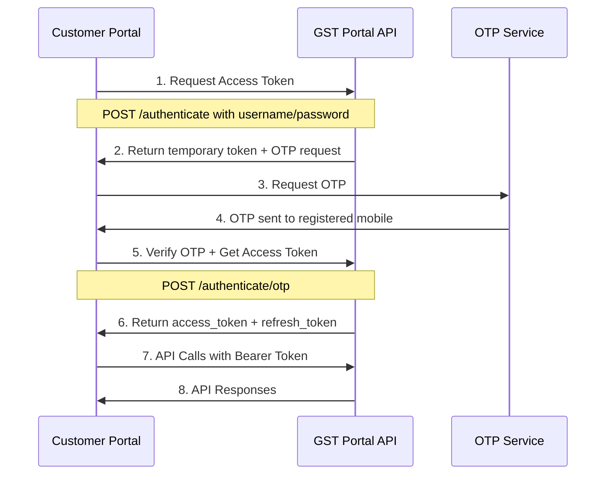
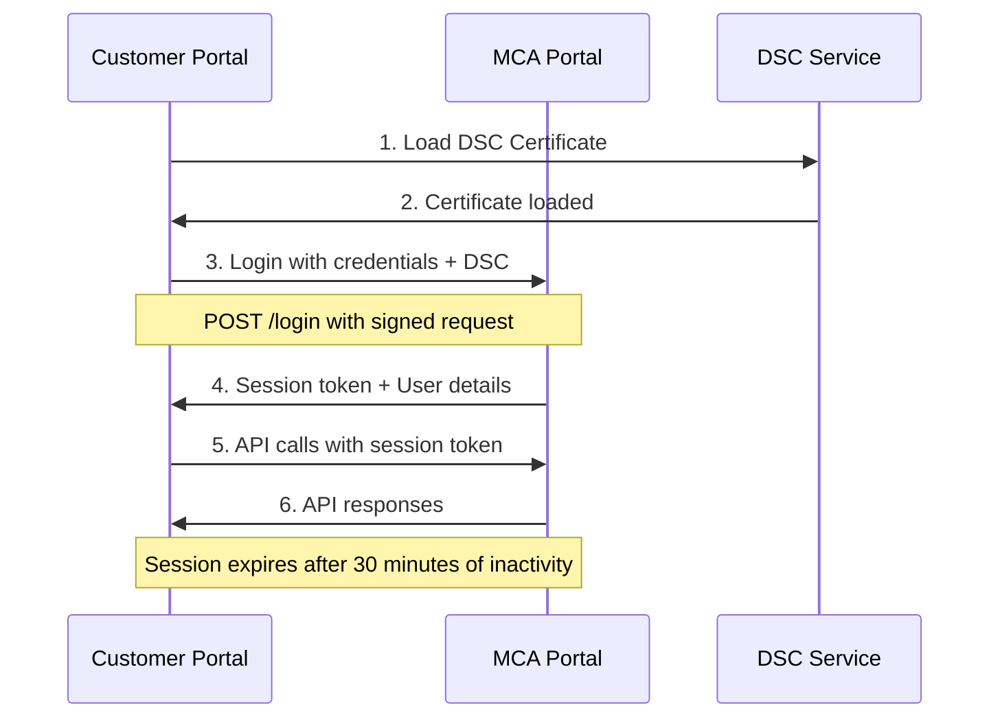
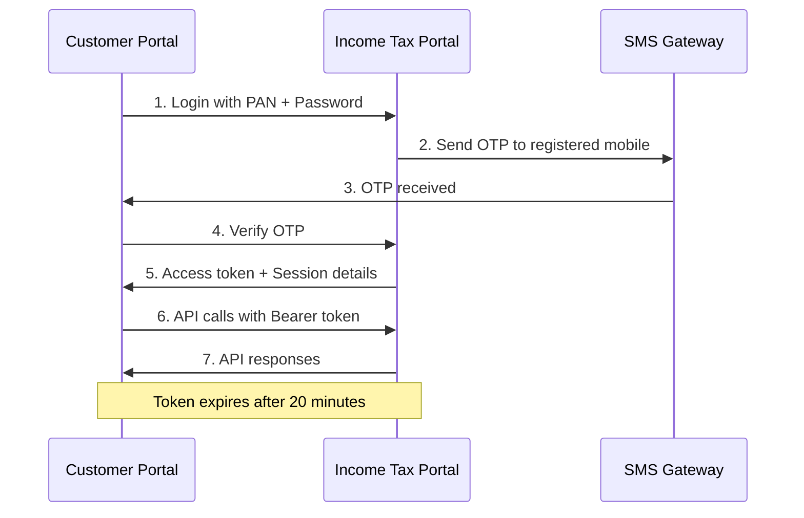

# Government Portal Integration Specifications

## Overview

This document details the integration specifications for connecting with various Indian government portals for automated compliance filing and data synchronization. The integration follows a unified architecture pattern while accommodating portal-specific requirements.

## Supported Government Portals

### 1. GST Portal (www.gst.gov.in)

#### Portal Details
- **Base URL**: `https://services.gst.gov.in`
- **API Version**: v1.3
- **Authentication**: OAuth 2.0 + OTP
- **Rate Limits**: 1000 requests/hour per GSTIN
- **Data Format**: JSON
- **Supported Operations**: Return filing, Payment, Ledger inquiry, Certificate download

#### Authentication Flow


#### API Endpoints
```javascript
const GST_ENDPOINTS = {
  // Authentication
  authenticate: '/authenticate',
  authenticateOtp: '/authenticate/otp',
  refreshToken: '/authenticate/refresh',
  
  // Return Filing
  getReturnStatus: '/returns/{gstin}/{ret_period}/status',
  saveReturn: '/returns/{gstin}/{ret_period}/save',
  submitReturn: '/returns/{gstin}/{ret_period}/submit',
  fileReturn: '/returns/{gstin}/{ret_period}/file',
  
  // Ledger Operations
  getCashLedger: '/ledgers/{gstin}/cash',
  getCreditLedger: '/ledgers/{gstin}/credit',
  getLiabilityLedger: '/ledgers/{gstin}/liability',
  
  // Certificates
  getRegistrationCertificate: '/certificates/{gstin}/registration',
  getComplianceCertificate: '/certificates/{gstin}/compliance',
  
  // Payments
  getChallanDetails: '/payments/{gstin}/challan/{challan_number}',
  generateChallan: '/payments/{gstin}/challan/generate'
};
```

#### Data Models
```javascript
// GST Return Data Structure
const GSTReturnData = {
  gstin: "27AABCU9603R1ZX",
  ret_period: "032024",
  version: "1.0",
  hash: "calculated_hash",
  data: {
    // B2B Sales
    b2b: [
      {
        ctin: "27AABCU9603R1ZY", // Customer GSTIN
        inv: [
          {
            inum: "INV001", // Invoice number
            idt: "18-03-2024", // Invoice date
            val: 118000, // Invoice value
            pos: "27", // Place of supply
            rchrg: "N", // Reverse charge
            inv_typ: "R", // Invoice type
            itms: [
              {
                num: 1,
                itm_det: {
                  txval: 100000, // Taxable value
                  rt: 18, // Tax rate
                  iamt: 18000, // IGST amount
                  camt: 0, // CGST amount
                  samt: 0 // SGST amount
                }
              }
            ]
          }
        ]
      }
    ],
    // B2C Sales
    b2cs: [
      {
        sply_ty: "INTRA", // Supply type
        pos: "27", // Place of supply
        typ: "OE", // Type
        txval: 50000, // Taxable value
        rt: 18, // Tax rate
        iamt: 9000 // IGST amount
      }
    ],
    // Input Tax Credit
    itc_elg: {
      itc_avl: [
        {
          ty: "IMPG", // ITC type
          liab: 5000, // Liability
          tx_i: 900, // IGST
          tx_c: 0, // CGST
          tx_s: 0 // SGST
        }
      ]
    }
  }
};
```

### 2. MCA Portal (www.mca.gov.in)

#### Portal Details
- **Base URL**: `https://www.mca.gov.in/mcafoportal`
- **API Version**: v2.0
- **Authentication**: Digital Signature Certificate (DSC) + Login credentials
- **Rate Limits**: 500 requests/day per DIN
- **Data Format**: XML/JSON hybrid
- **Supported Operations**: Form filing, Document upload, Certificate download, Company search

#### Authentication Flow


#### API Endpoints
```javascript
const MCA_ENDPOINTS = {
  // Authentication
  login: '/login',
  logout: '/logout',
  validateSession: '/session/validate',
  
  // Company Operations
  getCompanyDetails: '/company/{cin}/details',
  searchCompany: '/company/search',
  getCompanyMasterData: '/company/{cin}/master',
  
  // Form Filing
  getFormTemplates: '/forms/templates',
  saveFormDraft: '/forms/{form_type}/save',
  submitForm: '/forms/{form_type}/submit',
  getFormStatus: '/forms/{srn}/status',
  
  // Document Management
  uploadDocument: '/documents/upload',
  downloadDocument: '/documents/{document_id}/download',
  getDocumentList: '/company/{cin}/documents',
  
  // Certificates
  getCertificateOfIncorporation: '/certificates/{cin}/incorporation',
  getComplianceCertificate: '/certificates/{cin}/compliance',
  
  // Fees and Payments
  calculateFees: '/fees/calculate',
  makePayment: '/payments/initiate',
  getPaymentStatus: '/payments/{payment_id}/status'
};
```

#### Data Models
```javascript
// MCA Form Data Structure (Example: AOC-4 - Annual Return)
const AOCFormData = {
  formType: "AOC-4",
  cin: "U72900DL2020PTC123456",
  companyName: "ABC Private Limited",
  financialYear: "2023-24",
  formData: {
    // Company Details
    companyDetails: {
      registeredOffice: {
        address: "123 Business Park",
        city: "New Delhi",
        state: "Delhi",
        pincode: "110001"
      },
      principalBusinessActivity: {
        code: "72900",
        description: "Other information technology and computer service activities"
      }
    },
    // Share Capital Details
    shareCapital: {
      authorizedCapital: 1000000,
      paidUpCapital: 500000,
      numberOfShares: 50000,
      faceValuePerShare: 10
    },
    // Director Details
    directors: [
      {
        din: "12345678",
        name: "John Doe",
        designation: "Managing Director",
        appointmentDate: "2020-01-15",
        shareholding: {
          shares: 25000,
          percentage: 50
        }
      }
    ],
    // Financial Information
    financialInfo: {
      totalAssets: 2500000,
      totalLiabilities: 1000000,
      revenue: 3000000,
      profit: 500000
    }
  },
  attachments: [
    {
      documentType: "AUDITED_FINANCIAL_STATEMENTS",
      fileName: "financial_statements_2023_24.pdf",
      fileSize: 2048576,
      checksum: "md5_hash"
    }
  ],
  fees: {
    baseFee: 4000,
    additionalFee: 0,
    totalFee: 4000
  }
};
```

### 3. Income Tax Portal (www.incometax.gov.in)

#### Portal Details
- **Base URL**: `https://eportal.incometax.gov.in`
- **API Version**: v1.0
- **Authentication**: PAN + Password + OTP
- **Rate Limits**: 2000 requests/day per PAN
- **Data Format**: JSON
- **Supported Operations**: Return filing, Tax payment, Refund status, Form 16 download

#### Authentication Flow


#### API Endpoints
```javascript
const INCOME_TAX_ENDPOINTS = {
  // Authentication
  login: '/auth/login',
  verifyOtp: '/auth/verify-otp',
  refreshToken: '/auth/refresh',
  
  // Return Filing
  getReturnTypes: '/returns/types',
  getReturnPrefill: '/returns/{pan}/{ay}/prefill',
  saveReturn: '/returns/{pan}/{ay}/save',
  submitReturn: '/returns/{pan}/{ay}/submit',
  getReturnStatus: '/returns/{pan}/{ay}/status',
  
  // Tax Payments
  getTaxLiability: '/tax/{pan}/{ay}/liability',
  makeAdvanceTax: '/payments/advance-tax',
  makeSelfAssessmentTax: '/payments/self-assessment',
  getPaymentHistory: '/payments/{pan}/history',
  
  // Refunds
  getRefundStatus: '/refunds/{pan}/status',
  getBankAccountDetails: '/profile/{pan}/bank-details',
  
  // Forms and Certificates
  downloadForm16: '/forms/{pan}/form16/{fy}',
  downloadTaxCertificate: '/certificates/{pan}/tax-deducted',
  
  // Profile Management
  getProfile: '/profile/{pan}',
  updateBankDetails: '/profile/{pan}/bank-details'
};
```

## Unified Integration Architecture

### 1. Portal Integration Service

```javascript
class GovernmentPortalIntegrationService {
  constructor() {
    this.portals = new Map();
    this.initializePortals();
  }

  initializePortals() {
    this.portals.set('GST', new GSTPortalAdapter());
    this.portals.set('MCA', new MCAPortalAdapter());
    this.portals.set('INCOME_TAX', new IncomeTaxPortalAdapter());
  }

  async authenticatePortal(portalType, credentials) {
    const portal = this.portals.get(portalType);
    if (!portal) {
      throw new Error(`Unsupported portal type: ${portalType}`);
    }
    
    return await portal.authenticate(credentials);
  }

  async syncPortalData(integrationId) {
    const integration = await GovernmentPortalIntegration.findById(integrationId);
    const portal = this.portals.get(integration.portalType);
    
    return await portal.syncData(integration);
  }

  async fileCompliance(complianceServiceId, filingData) {
    const complianceService = await ComplianceService.findById(complianceServiceId)
      .populate('governmentPortalIntegrationId');
    
    const portal = this.portals.get(
      complianceService.governmentPortalIntegrationId.portalType
    );
    
    return await portal.fileCompliance(complianceService, filingData);
  }
}
```

### 2. Base Portal Adapter

```javascript
class BasePortalAdapter {
  constructor(config) {
    this.config = config;
    this.httpClient = new PortalHttpClient(config);
    this.rateLimiter = new RateLimiter(config.rateLimits);
    this.cache = new PortalCache(config.cacheConfig);
  }

  async authenticate(credentials) {
    throw new Error('authenticate method must be implemented');
  }

  async syncData(integration) {
    throw new Error('syncData method must be implemented');
  }

  async fileCompliance(complianceService, filingData) {
    throw new Error('fileCompliance method must be implemented');
  }

  async validateCredentials(credentials) {
    throw new Error('validateCredentials method must be implemented');
  }

  async handleApiError(error, context) {
    const errorLog = {
      timestamp: new Date(),
      errorType: error.type || 'API_ERROR',
      errorMessage: error.message,
      errorDetails: {
        statusCode: error.statusCode,
        response: error.response,
        context
      },
      resolved: false
    };

    // Log error to database
    await this.logError(errorLog);

    // Implement retry logic for transient errors
    if (this.isRetryableError(error)) {
      return await this.retryRequest(context);
    }

    throw error;
  }

  isRetryableError(error) {
    const retryableStatusCodes = [429, 502, 503, 504];
    return retryableStatusCodes.includes(error.statusCode);
  }

  async retryRequest(context, maxRetries = 3) {
    for (let attempt = 1; attempt <= maxRetries; attempt++) {
      try {
        await this.delay(Math.pow(2, attempt) * 1000); // Exponential backoff
        return await this.executeRequest(context);
      } catch (error) {
        if (attempt === maxRetries) {
          throw error;
        }
      }
    }
  }

  delay(ms) {
    return new Promise(resolve => setTimeout(resolve, ms));
  }
}
```

### 3. GST Portal Adapter

```javascript
class GSTPortalAdapter extends BasePortalAdapter {
  constructor() {
    super({
      baseUrl: 'https://services.gst.gov.in',
      rateLimits: {
        requestsPerHour: 1000,
        requestsPerMinute: 50
      },
      timeout: 30000
    });
  }

  async authenticate(credentials) {
    try {
      // Step 1: Initial authentication
      const authResponse = await this.httpClient.post('/authenticate', {
        username: credentials.username,
        password: credentials.password,
        app_key: this.config.appKey
      });

      // Step 2: OTP verification
      const otpToken = authResponse.data.auth_token;
      
      // In production, OTP would be sent to user's mobile
      // For now, we'll simulate OTP verification
      const otpResponse = await this.httpClient.post('/authenticate/otp', {
        auth_token: otpToken,
        otp: credentials.otp
      });

      const accessToken = otpResponse.data.access_token;
      const refreshToken = otpResponse.data.refresh_token;

      // Store tokens securely
      await this.storeTokens(credentials.entityId, {
        accessToken,
        refreshToken,
        expiresAt: new Date(Date.now() + 6 * 60 * 60 * 1000) // 6 hours
      });

      return {
        success: true,
        accessToken,
        expiresAt: new Date(Date.now() + 6 * 60 * 60 * 1000)
      };

    } catch (error) {
      return await this.handleApiError(error, 'GST_AUTHENTICATION');
    }
  }

  async syncData(integration) {
    try {
      const gstin = integration.credentials.additionalFields.gstin;
      
      // Sync return status for current and previous periods
      const periods = this.getRecentPeriods(6); // Last 6 months
      const syncResults = [];

      for (const period of periods) {
        const returnStatus = await this.getReturnStatus(gstin, period);
        syncResults.push({
          period,
          status: returnStatus,
          syncedAt: new Date()
        });
      }

      // Update integration sync information
      await GovernmentPortalIntegration.findByIdAndUpdate(integration._id, {
        lastSyncDate: new Date(),
        lastSuccessfulSync: new Date(),
        'metadata.lastSyncResults': syncResults
      });

      return {
        success: true,
        syncedPeriods: periods.length,
        results: syncResults
      };

    } catch (error) {
      return await this.handleApiError(error, 'GST_SYNC');
    }
  }

  async fileCompliance(complianceService, filingData) {
    try {
      const integration = complianceService.governmentPortalIntegrationId;
      const gstin = integration.credentials.additionalFields.gstin;
      const returnPeriod = this.formatReturnPeriod(filingData.returnPeriod);

      // Step 1: Save return data
      const saveResponse = await this.saveReturn(gstin, returnPeriod, filingData);
      
      // Step 2: Submit return for processing
      const submitResponse = await this.submitReturn(gstin, returnPeriod);
      
      // Step 3: File return (final submission)
      const fileResponse = await this.fileReturn(gstin, returnPeriod);

      // Update compliance service with filing details
      await ComplianceService.findByIdAndUpdate(complianceService._id, {
        status: 'FILED',
        'filingDetails.filingReference': fileResponse.reference_id,
        'filingDetails.filingDate': new Date(),
        'filingDetails.acknowledgmentNumber': fileResponse.ack_num,
        'filingDetails.acknowledgmentDate': new Date(fileResponse.ack_dt)
      });

      return {
        success: true,
        filingReference: fileResponse.reference_id,
        acknowledgmentNumber: fileResponse.ack_num,
        status: 'FILED'
      };

    } catch (error) {
      return await this.handleApiError(error, 'GST_FILING');
    }
  }

  async getReturnStatus(gstin, period) {
    const response = await this.httpClient.get(
      `/returns/${gstin}/${period}/status`,
      {
        headers: {
          'Authorization': `Bearer ${await this.getAccessToken(gstin)}`
        }
      }
    );
    
    return response.data;
  }

  async saveReturn(gstin, period, data) {
    const response = await this.httpClient.post(
      `/returns/${gstin}/${period}/save`,
      data,
      {
        headers: {
          'Authorization': `Bearer ${await this.getAccessToken(gstin)}`,
          'Content-Type': 'application/json'
        }
      }
    );
    
    return response.data;
  }

  formatReturnPeriod(period) {
    // Convert "03/2024" to "032024"
    return period.replace('/', '');
  }

  getRecentPeriods(count) {
    const periods = [];
    const now = new Date();
    
    for (let i = 0; i < count; i++) {
      const date = new Date(now.getFullYear(), now.getMonth() - i, 1);
      const month = String(date.getMonth() + 1).padStart(2, '0');
      const year = date.getFullYear();
      periods.push(`${month}${year}`);
    }
    
    return periods;
  }
}
```

## Error Handling and Retry Logic

### 1. Error Classification

```javascript
const PORTAL_ERROR_TYPES = {
  // Authentication errors
  INVALID_CREDENTIALS: 'Invalid username or password',
  OTP_EXPIRED: 'OTP has expired',
  SESSION_EXPIRED: 'Session has expired',
  
  // Rate limiting errors
  RATE_LIMIT_EXCEEDED: 'Rate limit exceeded',
  QUOTA_EXCEEDED: 'Daily quota exceeded',
  
  // Validation errors
  INVALID_DATA_FORMAT: 'Invalid data format',
  MISSING_REQUIRED_FIELDS: 'Missing required fields',
  BUSINESS_RULE_VIOLATION: 'Business rule violation',
  
  // System errors
  PORTAL_MAINTENANCE: 'Portal under maintenance',
  NETWORK_ERROR: 'Network connectivity error',
  TIMEOUT_ERROR: 'Request timeout',
  
  // Filing errors
  DUPLICATE_FILING: 'Return already filed for this period',
  FILING_WINDOW_CLOSED: 'Filing window closed',
  INSUFFICIENT_BALANCE: 'Insufficient balance for payment'
};
```

### 2. Retry Strategy

```javascript
class PortalRetryStrategy {
  constructor() {
    this.retryConfig = {
      maxRetries: 3,
      baseDelay: 1000,
      maxDelay: 30000,
      backoffMultiplier: 2
    };
  }

  shouldRetry(error, attempt) {
    if (attempt >= this.retryConfig.maxRetries) {
      return false;
    }

    // Retry on specific error types
    const retryableErrors = [
      'RATE_LIMIT_EXCEEDED',
      'NETWORK_ERROR',
      'TIMEOUT_ERROR',
      'PORTAL_MAINTENANCE'
    ];

    return retryableErrors.includes(error.type);
  }

  calculateDelay(attempt) {
    const delay = this.retryConfig.baseDelay * 
      Math.pow(this.retryConfig.backoffMultiplier, attempt - 1);
    
    return Math.min(delay, this.retryConfig.maxDelay);
  }

  async executeWithRetry(operation, context) {
    let lastError;
    
    for (let attempt = 1; attempt <= this.retryConfig.maxRetries + 1; attempt++) {
      try {
        return await operation();
      } catch (error) {
        lastError = error;
        
        if (!this.shouldRetry(error, attempt)) {
          break;
        }
        
        const delay = this.calculateDelay(attempt);
        await this.delay(delay);
        
        // Log retry attempt
        console.log(`Retrying operation after ${delay}ms (attempt ${attempt})`);
      }
    }
    
    throw lastError;
  }

  delay(ms) {
    return new Promise(resolve => setTimeout(resolve, ms));
  }
}
```

## Security Considerations

### 1. Credential Encryption

```javascript
class CredentialManager {
  constructor() {
    this.encryptionKey = process.env.PORTAL_ENCRYPTION_KEY;
    this.algorithm = 'aes-256-gcm';
  }

  encrypt(data) {
    const iv = crypto.randomBytes(16);
    const cipher = crypto.createCipher(this.algorithm, this.encryptionKey);
    cipher.setAAD(Buffer.from('portal-credentials'));
    
    let encrypted = cipher.update(JSON.stringify(data), 'utf8', 'hex');
    encrypted += cipher.final('hex');
    
    const authTag = cipher.getAuthTag();
    
    return {
      encrypted,
      iv: iv.toString('hex'),
      authTag: authTag.toString('hex')
    };
  }

  decrypt(encryptedData) {
    const decipher = crypto.createDecipher(this.algorithm, this.encryptionKey);
    decipher.setAAD(Buffer.from('portal-credentials'));
    decipher.setAuthTag(Buffer.from(encryptedData.authTag, 'hex'));
    
    let decrypted = decipher.update(encryptedData.encrypted, 'hex', 'utf8');
    decrypted += decipher.final('utf8');
    
    return JSON.parse(decrypted);
  }
}
```

### 2. Token Management

```javascript
class TokenManager {
  constructor() {
    this.redis = new Redis(process.env.REDIS_URL);
  }

  async storeToken(entityId, portalType, tokenData) {
    const key = `portal:token:${entityId}:${portalType}`;
    const encrypted = this.credentialManager.encrypt(tokenData);
    
    await this.redis.setex(
      key,
      tokenData.expiresIn || 3600,
      JSON.stringify(encrypted)
    );
  }

  async getToken(entityId, portalType) {
    const key = `portal:token:${entityId}:${portalType}`;
    const encryptedData = await this.redis.get(key);
    
    if (!encryptedData) {
      return null;
    }
    
    const encrypted = JSON.parse(encryptedData);
    return this.credentialManager.decrypt(encrypted);
  }

  async refreshToken(entityId, portalType) {
    const tokenData = await this.getToken(entityId, portalType);
    
    if (!tokenData || !tokenData.refreshToken) {
      throw new Error('No refresh token available');
    }
    
    const portal = this.getPortalAdapter(portalType);
    const newTokenData = await portal.refreshAccessToken(tokenData.refreshToken);
    
    await this.storeToken(entityId, portalType, newTokenData);
    return newTokenData;
  }
}
```

## Monitoring and Logging

### 1. Portal Integration Metrics

```javascript
const PORTAL_METRICS = {
  // Success rates
  authentication_success_rate: 'portal.auth.success_rate',
  filing_success_rate: 'portal.filing.success_rate',
  sync_success_rate: 'portal.sync.success_rate',
  
  // Response times
  authentication_duration: 'portal.auth.duration',
  filing_duration: 'portal.filing.duration',
  sync_duration: 'portal.sync.duration',
  
  // Error rates
  authentication_error_rate: 'portal.auth.error_rate',
  filing_error_rate: 'portal.filing.error_rate',
  rate_limit_error_rate: 'portal.rate_limit.error_rate',
  
  // Volume metrics
  daily_api_calls: 'portal.api_calls.daily',
  monthly_filings: 'portal.filings.monthly'
};
```

### 2. Audit Logging

```javascript
class PortalAuditLogger {
  constructor() {
    this.logger = new Logger('PortalIntegration');
  }

  logAuthentication(entityId, portalType, success, details) {
    this.logger.info('Portal Authentication', {
      entityId,
      portalType,
      success,
      timestamp: new Date(),
      details
    });
  }

  logFiling(complianceServiceId, portalType, status, details) {
    this.logger.info('Compliance Filing', {
      complianceServiceId,
      portalType,
      status,
      timestamp: new Date(),
      details
    });
  }

  logSync(integrationId, portalType, recordsProcessed, errors) {
    this.logger.info('Portal Data Sync', {
      integrationId,
      portalType,
      recordsProcessed,
      errors: errors.length,
      timestamp: new Date()
    });
  }

  logError(operation, error, context) {
    this.logger.error('Portal Integration Error', {
      operation,
      error: {
        type: error.type,
        message: error.message,
        stack: error.stack
      },
      context,
      timestamp: new Date()
    });
  }
}
```

## Testing Strategy

### 1. Portal Mock Services

```javascript
class MockGSTPortal {
  constructor() {
    this.mockData = new Map();
    this.setupMockResponses();
  }

  setupMockResponses() {
    // Mock authentication response
    this.mockData.set('authenticate', {
      success: true,
      auth_token: 'mock_auth_token_123',
      expires_in: 300
    });

    // Mock return status
    this.mockData.set('return_status', {
      gstin: '27AABCU9603R1ZX',
      ret_period: '032024',
      status: 'FILED',
      arn: 'AA270320241234567890',
      dof: '2024-04-18'
    });
  }

  async authenticate(credentials) {
    // Simulate API delay
    await this.delay(1000);
    
    if (credentials.username === 'test_user' && credentials.password === 'test_pass') {
      return this.mockData.get('authenticate');
    }
    
    throw new Error('Invalid credentials');
  }

  async getReturnStatus(gstin, period) {
    await this.delay(500);
    return this.mockData.get('return_status');
  }

  delay(ms) {
    return new Promise(resolve => setTimeout(resolve, ms));
  }
}
```

### 2. Integration Tests

```javascript
describe('Government Portal Integration', () => {
  let portalService;
  let mockGSTPortal;

  beforeEach(() => {
    mockGSTPortal = new MockGSTPortal();
    portalService = new GovernmentPortalIntegrationService();
    portalService.portals.set('GST', mockGSTPortal);
  });

  describe('Authentication', () => {
    it('should authenticate successfully with valid credentials', async () => {
      const credentials = {
        username: 'test_user',
        password: 'test_pass',
        otp: '123456'
      };

      const result = await portalService.authenticatePortal('GST', credentials);
      
      expect(result.success).toBe(true);
      expect(result.accessToken).toBeDefined();
    });

    it('should handle authentication failure', async () => {
      const credentials = {
        username: 'invalid_user',
        password: 'invalid_pass'
      };

      await expect(
        portalService.authenticatePortal('GST', credentials)
      ).rejects.toThrow('Invalid credentials');
    });
  });

  describe('Data Synchronization', () => {
    it('should sync portal data successfully', async () => {
      const integration = {
        _id: 'integration_id',
        portalType: 'GST',
        credentials: {
          additionalFields: {
            gstin: '27AABCU9603R1ZX'
          }
        }
      };

      const result = await portalService.syncPortalData(integration);
      
      expect(result.success).toBe(true);
      expect(result.syncedPeriods).toBeGreaterThan(0);