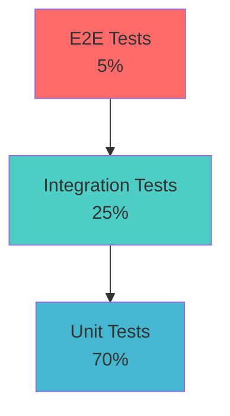

# Compliance Integration Testing Strategy

## Overview

This document outlines the comprehensive testing strategy for the compliance integration with the customer portal backend. The strategy ensures >90% test coverage across all compliance functionality while maintaining the existing system's reliability.

## Testing Pyramid



## Test Categories

### 1. Unit Tests (70% of total tests)

#### Model Tests
```javascript
// ComplianceService Model Tests
describe('ComplianceService Model', () => {
  describe('Validation', () => {
    it('should require entityId', async () => {
      const service = new ComplianceService({
        complianceType: 'GST_FILING',
        dueDate: new Date()
      });
      
      const error = service.validateSync();
      expect(error.errors.entityId).toBeDefined();
    });

    it('should validate complianceType enum', async () => {
      const service = new ComplianceService({
        entityId: 'valid_entity_id',
        complianceType: 'INVALID_TYPE',
        dueDate: new Date()
      });
      
      const error = service.validateSync();
      expect(error.errors.complianceType).toBeDefined();
    });

    it('should validate due date is in future for new services', async () => {
      const pastDate = new Date();
      pastDate.setDate(pastDate.getDate() - 1);
      
      const service = new ComplianceService({
        entityId: 'valid_entity_id',
        complianceType: 'GST_FILING',
        dueDate: pastDate
      });
      
      const error = service.validateSync();
      expect(error.errors.dueDate).toBeDefined();
    });
  });

  describe('Methods', () => {
    it('should calculate penalty correctly', async () => {
      const service = new ComplianceService({
        entityId: 'entity_id',
        complianceType: 'GST_FILING',
        dueDate: new Date('2024-04-20'),
        penaltyStructure: {
          basePenalty: 200,
          dailyPenalty: 25,
          maxPenalty: 5000,
          penaltyCalculationMethod: 'DAILY'
        }
      });

      const penalty = service.calculatePenalty(new Date('2024-04-25'));
      expect(penalty).toBe(325); // 200 + (5 * 25)
    });

    it('should not exceed max penalty', async () => {
      const service = new ComplianceService({
        entityId: 'entity_id',
        complianceType: 'GST_FILING',
        dueDate: new Date('2024-04-20'),
        penaltyStructure: {
          basePenalty: 200,
          dailyPenalty: 25,
          maxPenalty: 300,
          penaltyCalculationMethod: 'DAILY'
        }
      });

      const penalty = service.calculatePenalty(new Date('2024-05-20'));
      expect(penalty).toBe(300); // Should cap at maxPenalty
    });

    it('should generate next due date for recurring compliance', async () => {
      const service = new ComplianceService({
        entityId: 'entity_id',
        complianceType: 'GST_FILING',
        dueDate: new Date('2024-04-20'),
        isRecurring: true,
        recurringPattern: {
          frequency: 'MONTHLY',
          interval: 1
        }
      });

      const nextDueDate = service.generateNextDueDate();
      expect(nextDueDate).toEqual(new Date('2024-05-20'));
    });
  });

  describe('Hooks', () => {
    it('should generate compliance service number on save', async () => {
      const service = new ComplianceService({
        entityId: 'entity_id',
        complianceType: 'GST_FILING',
        dueDate: new Date('2024-04-20')
      });

      await service.save();
      expect(service.complianceServiceNumber).toMatch(/^COMP-\d{4}-\d{3}$/);
    });

    it('should create calendar entry on save', async () => {
      const service = new ComplianceService({
        entityId: 'entity_id',
        complianceType: 'GST_FILING',
        dueDate: new Date('2024-04-20')
      });

      await service.save();
      
      const calendarEntry = await ComplianceCalendar.findOne({
        complianceServiceId: service._id
      });
      
      expect(calendarEntry).toBeDefined();
      expect(calendarEntry.dueDate).toEqual(service.dueDate);
    });
  });
});
```

#### Service Tests
```javascript
// ComplianceService Service Tests
describe('ComplianceService Service', () => {
  let complianceService;
  let mockEntity;
  let mockUser;

  beforeEach(async () => {
    complianceService = new ComplianceServiceService();
    mockEntity = await createMockEntity();
    mockUser = await createMockUser();
  });

  describe('createComplianceService', () => {
    it('should create compliance service successfully', async () => {
      const serviceData = {
        entityId: mockEntity._id,
        complianceType: 'GST_FILING',
        complianceName: 'GST Return Filing - March 2024',
        dueDate: new Date('2024-04-20'),
        isRecurring: true,
        recurringPattern: {
          frequency: 'MONTHLY',
          interval: 1
        }
      };

      const result = await complianceService.createComplianceService(
        serviceData,
        mockUser._id
      );

      expect(result.success).toBe(true);
      expect(result.data.service.complianceServiceNumber).toBeDefined();
      expect(result.data.service.status).toBe('SCHEDULED');
    });

    it('should handle duplicate compliance service', async () => {
      const serviceData = {
        entityId: mockEntity._id,
        complianceType: 'GST_FILING',
        complianceName: 'GST Return Filing - March 2024',
        dueDate: new Date('2024-04-20')
      };

      // Create first service
      await complianceService.createComplianceService(serviceData, mockUser._id);

      // Try to create duplicate
      const result = await complianceService.createComplianceService(
        serviceData,
        mockUser._id
      );

      expect(result.success).toBe(false);
      expect(result.error.code).toBe('COMPLIANCE_SERVICE_ALREADY_EXISTS');
    });

    it('should validate entity permissions', async () => {
      const unauthorizedUser = await createMockUser({ role: 'VIEWER' });
      const serviceData = {
        entityId: mockEntity._id,
        complianceType: 'GST_FILING',
        dueDate: new Date('2024-04-20')
      };

      const result = await complianceService.createComplianceService(
        serviceData,
        unauthorizedUser._id
      );

      expect(result.success).toBe(false);
      expect(result.error.code).toBe('INSUFFICIENT_PERMISSIONS');
    });
  });

  describe('getComplianceServices', () => {
    beforeEach(async () => {
      // Create test compliance services
      await createMockComplianceServices(mockEntity._id, 15);
    });

    it('should return paginated compliance services', async () => {
      const result = await complianceService.getComplianceServices({
        entityId: mockEntity._id,
        page: 1,
        limit: 10
      });

      expect(result.success).toBe(true);
      expect(result.data.services).toHaveLength(10);
      expect(result.data.pagination.totalItems).toBe(15);
      expect(result.data.pagination.totalPages).toBe(2);
    });

    it('should filter by compliance type', async () => {
      const result = await complianceService.getComplianceServices({
        entityId: mockEntity._id,
        complianceType: 'GST_FILING'
      });

      expect(result.success).toBe(true);
      result.data.services.forEach(service => {
        expect(service.complianceType).toBe('GST_FILING');
      });
    });

    it('should filter by due date range', async () => {
      const startDate = new Date('2024-04-01');
      const endDate = new Date('2024-04-30');

      const result = await complianceService.getComplianceServices({
        entityId: mockEntity._id,
        dueDate: { from: startDate, to: endDate }
      });

      expect(result.success).toBe(true);
      result.data.services.forEach(service => {
        expect(service.dueDate).toBeGreaterThanOrEqual(startDate);
        expect(service.dueDate).toBeLessThanOrEqual(endDate);
      });
    });
  });

  describe('transitionStage', () => {
    let mockComplianceService;
    let mockStages;

    beforeEach(async () => {
      mockComplianceService = await createMockComplianceService(mockEntity._id);
      mockStages = await createMockComplianceStages(mockComplianceService._id);
    });

    it('should transition to next stage successfully', async () => {
      const result = await complianceService.transitionStage(
        mockComplianceService._id,
        mockStages[1]._id,
        mockUser._id,
        { notes: 'Documents verified' }
      );

      expect(result.success).toBe(true);
      expect(result.data.service.currentStageId).toEqual(mockStages[1]._id);
    });

    it('should validate stage transition rules', async () => {
      // Try to skip a stage
      const result = await complianceService.transitionStage(
        mockComplianceService._id,
        mockStages[2]._id, // Skip stage 1
        mockUser._id
      );

      expect(result.success).toBe(false);
      expect(result.error.code).toBe('INVALID_STAGE_TRANSITION');
    });

    it('should check stage requirements', async () => {
      // Mock stage with document requirements
      const stageWithRequirements = mockStages[1];
      stageWithRequirements.documentRequirements = [
        { documentTypeId: 'doc_type_id', isRequired: true }
      ];

      const result = await complianceService.transitionStage(
        mockComplianceService._id,
        stageWithRequirements._id,
        mockUser._id
      );

      expect(result.success).toBe(false);
      expect(result.error.code).toBe('STAGE_REQUIREMENTS_NOT_MET');
    });
  });
});
```

#### Controller Tests
```javascript
// Compliance Controller Tests
describe('Compliance Controller', () => {
  let app;
  let authToken;
  let mockEntity;

  beforeAll(async () => {
    app = await createTestApp();
    authToken = await getAuthToken();
    mockEntity = await createMockEntity();
  });

  describe('POST /api/v1/compliance/services', () => {
    it('should create compliance service with valid data', async () => {
      const serviceData = {
        entityId: mockEntity._id,
        complianceType: 'GST_FILING',
        complianceName: 'GST Return Filing - March 2024',
        dueDate: '2024-04-20T00:00:00.000Z',
        isRecurring: true,
        recurringPattern: {
          frequency: 'MONTHLY',
          interval: 1
        }
      };

      const response = await request(app)
        .post('/api/v1/compliance/services')
        .set('Authorization', `Bearer ${authToken}`)
        .send(serviceData)
        .expect(201);

      expect(response.body.success).toBe(true);
      expect(response.body.data.service.complianceServiceNumber).toBeDefined();
    });

    it('should validate required fields', async () => {
      const invalidData = {
        complianceType: 'GST_FILING'
        // Missing entityId and dueDate
      };

      const response = await request(app)
        .post('/api/v1/compliance/services')
        .set('Authorization', `Bearer ${authToken}`)
        .send(invalidData)
        .expect(400);

      expect(response.body.success).toBe(false);
      expect(response.body.error.code).toBe('VALIDATION_ERROR');
    });

    it('should require authentication', async () => {
      const serviceData = {
        entityId: mockEntity._id,
        complianceType: 'GST_FILING',
        dueDate: '2024-04-20T00:00:00.000Z'
      };

      await request(app)
        .post('/api/v1/compliance/services')
        .send(serviceData)
        .expect(401);
    });
  });

  describe('GET /api/v1/compliance/services', () => {
    beforeEach(async () => {
      await createMockComplianceServices(mockEntity._id, 25);
    });

    it('should return paginated compliance services', async () => {
      const response = await request(app)
        .get('/api/v1/compliance/services')
        .query({ entityId: mockEntity._id, page: 1, limit: 10 })
        .set('Authorization', `Bearer ${authToken}`)
        .expect(200);

      expect(response.body.success).toBe(true);
      expect(response.body.data.services).toHaveLength(10);
      expect(response.body.data.pagination.totalItems).toBe(25);
    });

    it('should filter by status', async () => {
      const response = await request(app)
        .get('/api/v1/compliance/services')
        .query({ entityId: mockEntity._id, status: 'SCHEDULED' })
        .set('Authorization', `Bearer ${authToken}`)
        .expect(200);

      expect(response.body.success).toBe(true);
      response.body.data.services.forEach(service => {
        expect(service.status).toBe('SCHEDULED');
      });
    });

    it('should require entityId parameter', async () => {
      await request(app)
        .get('/api/v1/compliance/services')
        .set('Authorization', `Bearer ${authToken}`)
        .expect(400);
    });
  });

  describe('PUT /api/v1/compliance/services/:serviceId/stages/transition', () => {
    let mockService;
    let mockStages;

    beforeEach(async () => {
      mockService = await createMockComplianceService(mockEntity._id);
      mockStages = await createMockComplianceStages(mockService._id);
    });

    it('should transition stage successfully', async () => {
      const transitionData = {
        targetStageId: mockStages[1]._id,
        notes: 'All documents verified'
      };

      const response = await request(app)
        .put(`/api/v1/compliance/services/${mockService._id}/stages/transition`)
        .set('Authorization', `Bearer ${authToken}`)
        .send(transitionData)
        .expect(200);

      expect(response.body.success).toBe(true);
      expect(response.body.data.service.currentStageId).toBe(mockStages[1]._id.toString());
    });

    it('should validate stage transition', async () => {
      const invalidTransition = {
        targetStageId: mockStages[2]._id // Skip stage 1
      };

      const response = await request(app)
        .put(`/api/v1/compliance/services/${mockService._id}/stages/transition`)
        .set('Authorization', `Bearer ${authToken}`)
        .send(invalidTransition)
        .expect(400);

      expect(response.body.success).toBe(false);
      expect(response.body.error.code).toBe('INVALID_STAGE_TRANSITION');
    });
  });
});
```

### 2. Integration Tests (25% of total tests)

#### Government Portal Integration Tests
```javascript
describe('Government Portal Integration', () => {
  let portalService;
  let mockEntity;
  let mockIntegration;

  beforeEach(async () => {
    portalService = new GovernmentPortalIntegrationService();
    mockEntity = await createMockEntity();
    mockIntegration = await createMockPortalIntegration(mockEntity._id, 'GST');
  });

  describe('GST Portal Integration', () => {
    it('should authenticate with GST portal', async () => {
      const credentials = {
        username: process.env.TEST_GST_USERNAME,
        password: process.env.TEST_GST_PASSWORD,
        otp: '123456' // Mock OTP for testing
      };

      const result = await portalService.authenticatePortal('GST', credentials);
      
      expect(result.success).toBe(true);
      expect(result.accessToken).toBeDefined();
    });

    it('should sync GST data', async () => {
      const result = await portalService.syncPortalData(mockIntegration._id);
      
      expect(result.success).toBe(true);
      expect(result.syncedPeriods).toBeGreaterThan(0);
    });

    it('should handle portal authentication failure', async () => {
      const invalidCredentials = {
        username: 'invalid_user',
        password: 'invalid_pass'
      };

      await expect(
        portalService.authenticatePortal('GST', invalidCredentials)
      ).rejects.toThrow('Authentication failed');
    });

    it('should handle rate limiting', async () => {
      // Simulate rate limit exceeded
      const rateLimitedPortal = new MockGSTPortal();
      rateLimitedPortal.setRateLimit(true);
      
      portalService.portals.set('GST', rateLimitedPortal);

      await expect(
        portalService.syncPortalData(mockIntegration._id)
      ).rejects.toThrow('Rate limit exceeded');
    });
  });

  describe('Filing Integration', () => {
    let mockComplianceService;

    beforeEach(async () => {
      mockComplianceService = await createMockComplianceService(mockEntity._id);
      mockComplianceService.governmentPortalIntegrationId = mockIntegration._id;
      await mockComplianceService.save();
    });

    it('should file GST return successfully', async () => {
      const filingData = {
        returnPeriod: '03/2024',
        returnData: {
          b2b: [],
          b2cs: [],
          itc_elg: {}
        }
      };

      const result = await portalService.fileCompliance(
        mockComplianceService._id,
        filingData
      );

      expect(result.success).toBe(true);
      expect(result.filingReference).toBeDefined();
      expect(result.acknowledgmentNumber).toBeDefined();
    });

    it('should handle filing validation errors', async () => {
      const invalidFilingData = {
        returnPeriod: '03/2024',
        returnData: {
          // Missing required fields
        }
      };

      await expect(
        portalService.fileCompliance(mockComplianceService._id, invalidFilingData)
      ).rejects.toThrow('Filing validation failed');
    });
  });
});
```

#### Database Integration Tests
```javascript
describe('Database Integration', () => {
  describe('Compliance Service CRUD Operations', () => {
    let mockEntity;

    beforeEach(async () => {
      mockEntity = await createMockEntity();
    });

    it('should create compliance service with all relationships', async () => {
      const serviceData = {
        entityId: mockEntity._id,
        complianceType: 'GST_FILING',
        dueDate: new Date('2024-04-20'),
        isRecurring: true,
        recurringPattern: {
          frequency: 'MONTHLY',
          interval: 1
        }
      };

      const service = new ComplianceService(serviceData);
      await service.save();

      // Verify calendar entry was created
      const calendarEntry = await ComplianceCalendar.findOne({
        complianceServiceId: service._id
      });
      expect(calendarEntry).toBeDefined();

      // Verify entity compliance stats were updated
      const updatedEntity = await Entity.findById(mockEntity._id);
      expect(updatedEntity.complianceProfile.complianceStats.totalCompliances).toBe(1);
    });

    it('should handle cascade operations on delete', async () => {
      const service = await createMockComplianceService(mockEntity._id);
      const calendarEntry = await ComplianceCalendar.findOne({
        complianceServiceId: service._id
      });

      await ComplianceService.findByIdAndDelete(service._id);

      // Verify calendar entry was also deleted
      const deletedCalendarEntry = await ComplianceCalendar.findById(calendarEntry._id);
      expect(deletedCalendarEntry).toBeNull();
    });
  });

  describe('Complex Queries', () => {
    beforeEach(async () => {
      await createMockComplianceData();
    });

    it('should execute compliance analytics query efficiently', async () => {
      const startTime = Date.now();
      
      const analytics = await ComplianceService.aggregate([
        {
          $match: {
            dueDate: {
              $gte: new Date('2024-01-01'),
              $lte: new Date('2024-12-31')
            }
          }
        },
        {
          $group: {
            _id: '$complianceType',
            total: { $sum: 1 },
            completed: {
              $sum: {
                $cond: [{ $eq: ['$status', 'COMPLETED'] }, 1, 0]
              }
            },
            overdue: {
              $sum: {
                $cond: [
                  {
                    $and: [
                      { $lt: ['$dueDate', new Date()] },
                      { $ne: ['$status', 'COMPLETED'] }
                    ]
                  },
                  1,
                  0
                ]
              }
            }
          }
        }
      ]);

      const executionTime = Date.now() - startTime;
      
      expect(analytics).toBeDefined();
      expect(executionTime).toBeLessThan(1000); // Should execute within 1 second
    });
  });
});
```

### 3. End-to-End Tests (5% of total tests)

#### Complete Compliance Workflow Tests
```javascript
describe('Complete Compliance Workflow E2E', () => {
  let browser;
  let page;
  let testEntity;
  let testUser;

  beforeAll(async () => {
    browser = await puppeteer.launch({ headless: false });
    page = await browser.newPage();
    testEntity = await createTestEntity();
    testUser = await createTestUser();
  });

  afterAll(async () => {
    await browser.close();
  });

  describe('GST Filing Workflow', () => {
    it('should complete full GST filing workflow', async () => {
      // Step 1: Login
      await page.goto(`${process.env.TEST_BASE_URL}/login`);
      await page.type('#email', testUser.email);
      await page.type('#password', 'test_password');
      await page.click('#login-button');
      await page.waitForNavigation();

      // Step 2: Navigate to compliance section
      await page.click('[data-testid="compliance-menu"]');
      await page.waitForSelector('[data-testid="compliance-dashboard"]');

      // Step 3: Create new compliance service
      await page.click('[data-testid="create-compliance-button"]');
      await page.waitForSelector('[data-testid="compliance-form"]');
      
      await page.select('#complianceType', 'GST_FILING');
      await page.type('#complianceName', 'GST Return Filing - March 2024');
      await page.type('#dueDate', '2024-04-20');
      await page.click('#isRecurring');
      await page.select('#frequency', 'MONTHLY');
      
      await page.click('[data-testid="create-service-button"]');
      await page.waitForSelector('[data-testid="success-message"]');

      // Step 4: Upload required documents
      await page.click('[data-testid="upload-documents-button"]');
      const fileInput = await page.$('input[type="file"]');
      await fileInput.uploadFile('./test-files/financial-statements.pdf');
      await page.click('[data-testid="upload-button"]');
      await page.waitForSelector('[data-testid="document-uploaded"]');

      // Step 5: Fill compliance form
      await page.click('[data-testid="fill-form-button"]');
      await page.waitForSelector('[data-testid="compliance-form-fields"]');
      
      await page.type('#turnover', '1500000');
      await page.type('#taxLiability', '270000');
      await page.click('[data-testid="save-form-button"]');

      // Step 6: Review and submit
      await page.click('[data-testid="review-button"]');
      await page.waitForSelector('[data-testid="review-summary"]');
      
      const summaryText = await page.$eval(
        '[data-testid="review-summary"]',
        el => el.textContent
      );
      expect(summaryText).toContain('GST Return Filing - March 2024');
      expect(summaryText).toContain('₹15,00,000');

      await page.click('[data-testid="submit-button"]');
      await page.waitForSelector('[data-testid="filing-success"]');

      // Step 7: Verify filing status
      const filingStatus = await page.$eval(
        '[data-testid="filing-status"]',
        el => el.textContent
      );
      expect(filingStatus).toContain('FILED');

      // Verify in database
      const complianceService = await ComplianceService.findOne({
        complianceName: 'GST Return Filing - March 2024'
      });
      expect(complianceService.status).toBe('FILED');
      expect(complianceService.filingDetails.filingReference).toBeDefined();
    });

    it('should handle filing errors gracefully', async () => {
      // Create compliance service with invalid data
      await page.goto(`${process.env.TEST_BASE_URL}/compliance/create`);
      
      await page.select('#complianceType', 'GST_FILING');
      await page.type('#complianceName', 'Invalid GST Filing');
      await page.type('#dueDate', '2024-04-20');
      
      await page.click('[data-testid="create-service-button"]');
      
      // Try to file without required documents
      await page.click('[data-testid="file-directly-button"]');
      
      await page.waitForSelector('[data-testid="error-message"]');
      const errorMessage = await page.$eval(
        '[data-testid="error-message"]',
        el => el.textContent
      );
      expect(errorMessage).toContain('Required documents missing');
    });
  });

  describe('Compliance Calendar Integration', () => {
    it('should display compliance calendar correctly', async () => {
      await page.goto(`${process.env.TEST_BASE_URL}/compliance/calendar`);
      await page.waitForSelector('[data-testid="compliance-calendar"]');

      // Check if calendar shows upcoming compliances
      const upcomingCompliances = await page.$$('[data-testid="calendar-entry"]');
      expect(upcomingCompliances.length).toBeGreaterThan(0);

      // Click on a calendar entry
      await page.click('[data-testid="calendar-entry"]:first-child');
      await page.waitForSelector('[data-testid="compliance-details"]');

      const detailsVisible = await page.$('[data-testid="compliance-details"]');
      expect(detailsVisible).toBeTruthy();
    });
  });
});
```

## Test Data Management

### 1. Test Data Factory

```javascript
class TestDataFactory {
  static async createMockEntity(overrides = {}) {
    const defaultData = {
      name: 'Test Company Ltd',
      entityType: 'PRIVATE_LIMITED',
      complianceProfile: {
        gstNumber: '27AABCU9603R1ZX',
        panNumber: 'AABCU9603R',
        complianceSettings: {
          autoFileEnabled: false,
          reminderPreferences: {
            email: true,
            daysBefore: 7
          }
        },
        complianceStats: {
          totalCompliances: 0,
          completedOnTime: 0,
          overdue: 0,
          totalPenalties: 0
        }
      }
    };

    const entityData = { ...defaultData, ...overrides };
    const entity = new Entity(entityData);
    await entity.save();
    return entity;
  }

  static async createMockComplianceService(entityId, overrides = {}) {
    const defaultData = {
      entityId,
      complianceType: 'GST_FILING',
      complianceCategory: 'PERIODIC_FILING',
      complianceName: 'Test GST Filing',
      regulatoryAuthority: 'GST_DEPARTMENT',
      dueDate: new Date(Date.now() + 7 * 24 * 60 * 60 * 1000), // 7 days from now
      status: 'SCHEDULED',
      isRecurring: false,
      penaltyStructure: {
        basePenalty: 200,
        dailyPenalty: 25,
        maxPenalty: 5000,
        penaltyCalculationMethod: 'DAILY'
      }
    };

    const serviceData = { ...defaultData, ...overrides };
    const service = new ComplianceService(serviceData);
    await service.save();
    return service;
  }

  static async createMockComplianceStages(complianceServiceId, count = 3) {
    const stages = [];
    const stageTypes = ['PREPARATION', 'REVIEW', 'FILING'];
    
    for (let i = 0; i < count; i++) {
      const stage = new ComplianceStage({
        code: `STAGE_${i + 1}`,
        name: `Stage ${i + 1}`,
        complianceServiceId,
        sequence: i,
        stageType: stageTypes[i] || 'PREPARATION',
        status: 'ACTIVE'
      });
      
      await stage.save();
      stages.push(stage);
    }
    
    return stages;
  }

  static async createMockPortalIntegration(entityId, portalType) {
    const integration = new GovernmentPortalIntegration({
      entityId,
      portalType,
      portalName: `${portalType} Portal`,
      credentials: {
        username: 'test_user',